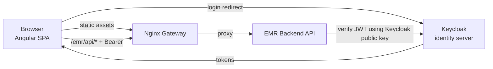
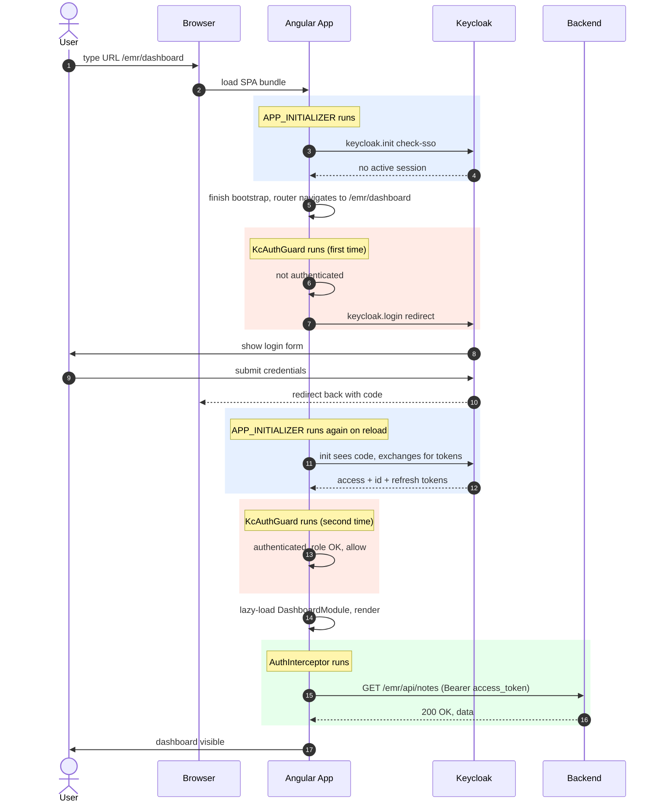
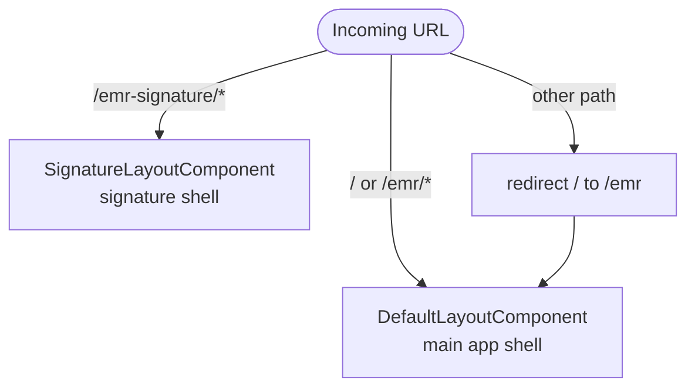
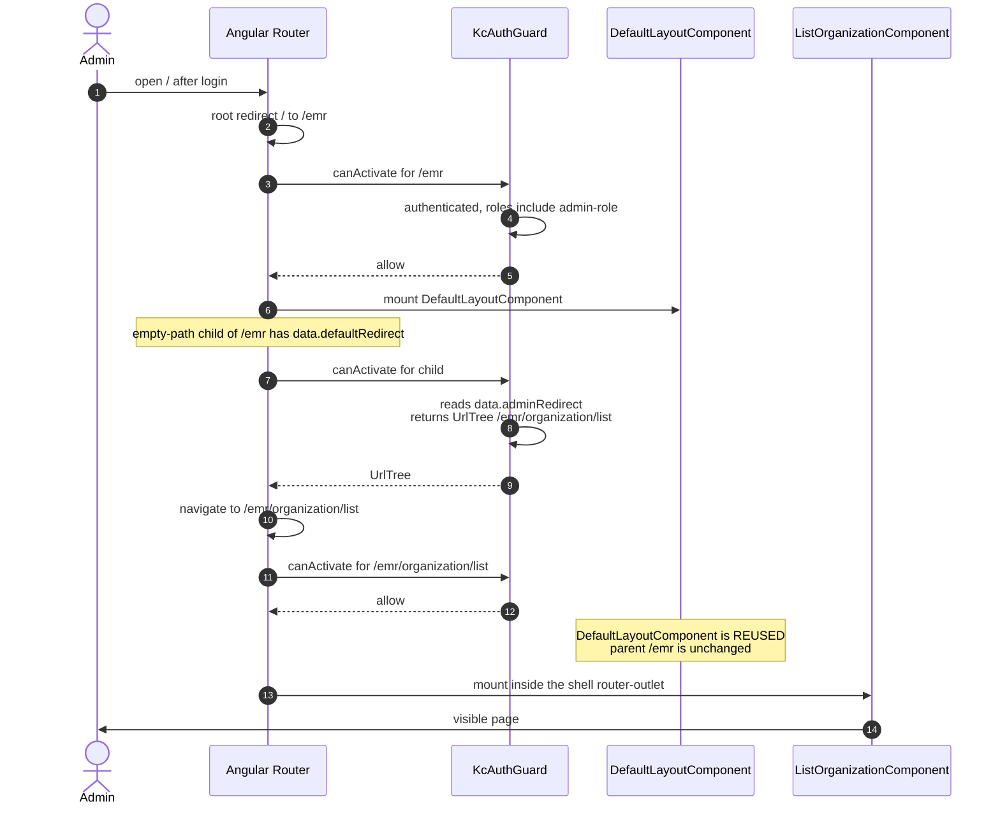
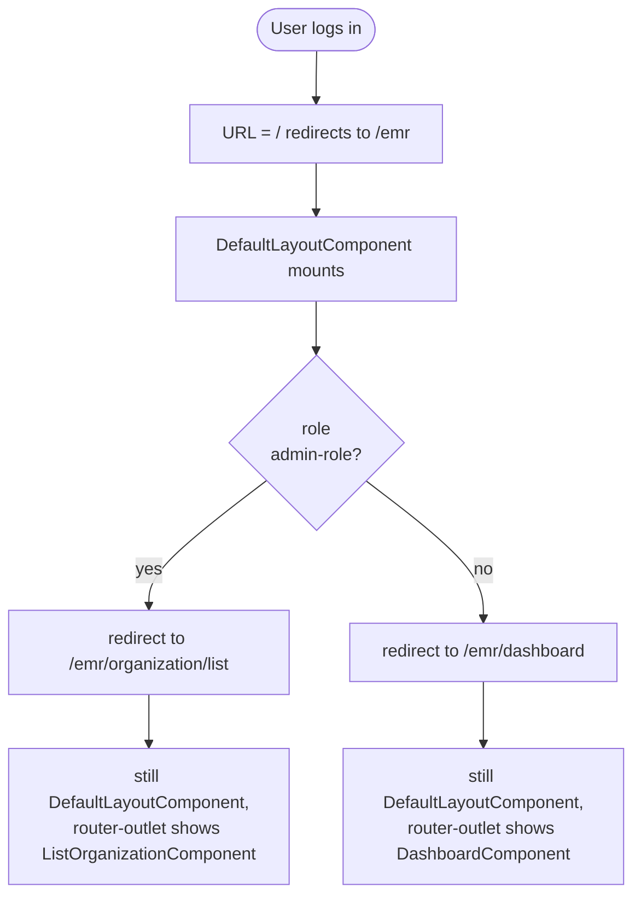
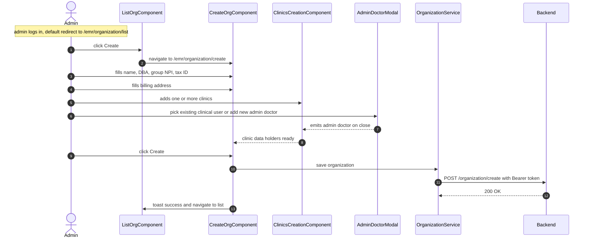

# Front End — Low-Level Design

Low-level documentation for the Angular front-end of the EMR system. Pair this with your high-level EMR overview doc (outside this repo) for the product picture. For the identity/Keycloak deep-dive, see [keycloak.md](keycloak.md).

---

## 1. Context — where the front end fits



The front end is the Angular 14 single-page application served to every user's browser. Every user interaction — logging in, creating an organization, writing a medical note, viewing patients — runs through the code in this repo.

**What the front end does:**

- Hosts the UI.
- Owns navigation (routing, layouts).
- Manages session state (via `keycloak-js`).
- Attaches bearer tokens to every backend call.
- Gates routes by role (for UX).

**What the front end does NOT do:**

- Hold tokens in `localStorage` or cookies we manage — tokens live only in `keycloak-js` memory.
- Make authorization decisions with security consequences — that is the backend's job. Frontend role checks are cosmetic; the real enforcement is in the JWT-validating backend.
- Talk directly to Keycloak's admin API — the backend does user provisioning through it.

## 2. Tech stack

| Layer | Technology |
|---|---|
| Framework | Angular 14 |
| UI kit | CoreUI Angular Pro + Bootstrap 5 + Angular Material (dialogs/form fields) |
| Identity | `keycloak-angular` + `keycloak-js` |
| Notifications | `ngx-toastr` |
| Spinner | `ngx-spinner` |
| Forms | Reactive forms (newer code) + template-driven forms (older code) |
| Build | Angular CLI (`ng build`) |

Full dependency list: `package.json`.

## 3. Project layout

One Angular workspace (`angular.json`) with two projects:

| Project | Type | Path |
|---|---|---|
| `emr-application` | app | `projects/emr-application` |
| `angular-calendar` | library | `projects/angular-calendar` |

Inside `projects/emr-application/src/app`:

```
├── app.module.ts
├── app-routing.module.ts
├── app.component.{ts,html,css}
├── core/                     # layouts (default, organization, signature)
├── icons/
├── util/                     # tiny helpers (addresses, names, form validators)
└── modules/                  # feature modules (lazy-loaded)
    ├── activation/
    ├── administration/
    ├── clinic/
    ├── common/               # shared building blocks (dialogs, forms, pipes, services)
    ├── dashboard/
    ├── doctor-signature/
    ├── incoming-cosign-docs/
    ├── insurance.company/
    ├── organization/         ← entry point, see § 7
    ├── patient/
    ├── referring.provider/
    ├── scheduler/
    ├── security/             ← see § 4
    ├── signup/
    └── users/
```

Each feature module follows the same shape:

```
modules/<feature>/
├── <feature>.module.ts
├── <feature>-routing.module.ts
├── components/       # UI components
├── services/         # HTTP facades + feature-level state
├── models/           # TypeScript interfaces
└── index.ts          # optional re-export barrel
```

---

## 4. Security module (how Keycloak plugs into Angular)

The `security` module is the most important module in the frontend — every request, every route, every navigation goes through it. It lives at `projects/emr-application/src/app/modules/security/`.

For the Keycloak deep-dive (IAM concepts, OAuth 2.0, OpenID Connect, PKCE, token lifecycle, realm/client config), see **[keycloak.md](keycloak.md)**. This section is about **how the Angular frontend wires Keycloak in** — starting with the user's journey, then zooming into each piece.

### 4.1 First, the journey — what happens when a user opens the app

Before looking at any code, walk through what actually happens the first time a new user opens the app. The three "connection points" you'll hear about (`APP_INITIALIZER`, `KcAuthGuard`, `AuthInterceptor`) will appear naturally in this sequence — you'll see them **in context** before reading a single line of code.

#### 4.1.1 Step by step

A user types `https://emr.example.com/emr/dashboard` into their browser. This is everything that happens, in order:

1. **Browser downloads the SPA bundle** — static files served by Nginx.
2. **Angular starts bootstrapping.** It reads `AppModule`, sets up dependency injection, prepares to render `AppComponent`.
3. **Pause — Angular notices `APP_INITIALIZER` providers.** Before rendering anything, it runs each initializer function and **waits for its promise to resolve**.
4. **Our `APP_INITIALIZER` = `keycloak.init(...)`.** `keycloak-js` sends a silent probe to Keycloak: *"does this browser already have an SSO session?"*
   - First visit → no → `authenticated = false`. No redirect yet.
   - Returning visit → yes → tokens picked up silently, `authenticated = true`.
5. **`keycloak.init` resolves.** Angular finishes bootstrap. Router starts its first navigation to `/emr/dashboard`.
6. **The route is `canActivate: [KcAuthGuard]`.** The guard runs.
7. **`KcAuthGuard` sees `authenticated = false`.** Calls `keycloak.login()` → browser redirects away to Keycloak's login page.
8. **User submits credentials on Keycloak** (different domain). MFA happens here if enabled.
9. **Keycloak redirects back** to the app with `?code=ABC123&state=...` in the URL.
10. **App bootstraps again.** `APP_INITIALIZER` fires again — this time `keycloak.init()` sees the `?code=...` and silently exchanges it for tokens (Authorization Code + PKCE flow — see [keycloak.md](keycloak.md) § 3.3).
11. **Router tries `/emr/dashboard` again.** `KcAuthGuard` now sees `authenticated = true`, fetches the user record from the backend, applies role checks — all pass.
12. **Angular lazy-loads and renders `DashboardModule`.**
13. **The dashboard component calls `/emr/api/notes`** (or any backend endpoint).
14. **`AuthInterceptor` runs.** Attaches `Authorization: Bearer <access_token>` to the outgoing request.
15. **Backend validates the token** (using Keycloak's public key, cached locally) and returns data.
16. **Dashboard renders with data.**

Notice where each of the three pieces appeared:

- Steps **3–4** → `APP_INITIALIZER` (first visit, no session)
- Steps **6–7** → `KcAuthGuard` (denies, redirects to login)
- Step **10** → `APP_INITIALIZER` again (now exchanges the returning code)
- Step **11** → `KcAuthGuard` again (now allows)
- Step **14** → `AuthInterceptor` (attaches token)

That single story contains every lifecycle moment the security module cares about.

#### 4.1.2 The journey as a diagram



Three colored blocks = three connection points.

- **Blue** = boot-time (`APP_INITIALIZER`)
- **Red** = route-time (`KcAuthGuard`)
- **Green** = HTTP-time (`AuthInterceptor`)

### 4.2 What each of the three does

Now that you have seen them in context, here is the dense summary.

| Piece | When it fires | Purpose | Question it answers |
|---|---|---|---|
| **`APP_INITIALIZER`** | **Once**, during app bootstrap, before any component renders | Initialize `keycloak-js`: detect existing session, exchange the `?code=...` if returning from login | *"Is this browser already logged in? What token state am I in?"* |
| **`KcAuthGuard`** | **Every** time the user navigates to a protected route | Decide whether to allow the navigation, redirect to Keycloak login, fence to a pending page, or apply a default redirect | *"Should this user be allowed on this page right now?"* |
| **`AuthInterceptor`** | **Every** HTTP request to the backend | Attach `Authorization: Bearer <access_token>` to the outgoing request; react to 401/403 responses (logout or pending-flag) | *"What token goes on this request? How should I react to the response?"* |

#### 4.2.1 Mnemonic — building analogy

Treat the app as a **multi-floor office building**, Keycloak as **the security desk in the lobby**:

- **`APP_INITIALIZER`** = the lobby's badge reader. Silently checks if you walked in with an active badge from earlier today, re-activates it if so.
- **`KcAuthGuard`** = guards stationed at each floor's door. Read your badge; let you in, send you to a different floor, or send you back to the security desk.
- **`AuthInterceptor`** = the clerk who stamps your badge number onto every document you send to the back office.

#### 4.2.2 How often each fires, in one session

```
App loads:
  APP_INITIALIZER runs                       (1 time)
User lands on /emr/dashboard:
  KcAuthGuard runs                           (1 time per navigation)
Dashboard page makes 4 API calls:
  AuthInterceptor runs                       (4 times)
User navigates to /emr/patient:
  KcAuthGuard runs again
Patient page makes 6 API calls:
  AuthInterceptor runs 6 more times
...
```

One fires at startup. One fires at navigation. One fires at HTTP request. They never overlap.

### 4.3 Module layout (reference)

Libraries the integration uses:

| Package | Role |
|---|---|
| `keycloak-js` | Raw Keycloak client. Handles login redirect, PKCE, code → token exchange, automatic refresh. |
| `keycloak-angular` | Thin Angular wrapper. Exposes `KeycloakService` as injectable and `KeycloakAuthGuard` as a base class for route guards. |

Files in `modules/security/`:

```
modules/security/
├── security.module.ts
├── keycloak-initializer.ts            # APP_INITIALIZER factory (Connection 1)
├── menu.items.constructor.ts          # builds sidebar from roles
├── role.item.converter/               # role → nav-entry converters (one per feature)
├── role.scope.request.build/
├── model/
│   ├── loggedin.user.ts
│   ├── nav.item.ts
│   ├── role.ts                        # 13 realm-role string constants
│   ├── scope.ts
│   └── provider-info.ts
└── service/
    ├── auth.interceptor.ts            # HTTP_INTERCEPTORS entry (Connection 3)
    ├── kc-auth.guard.ts               # canActivate (Connection 2)
    ├── kc-auth.service.ts             # thin facade over KeycloakService
    ├── pending-activation.guard.ts    # canActivateChild: account-status fencing
    ├── pending-activation.service.ts
    ├── permission.service.ts
    ├── render-nav-items.service.ts
    ├── role-scope-finder.service.ts
    ├── scope.guard.ts
    └── loggedIn/
        └── logged-in.service.ts
```

The next three subsections zoom into each connection point, with the actual code:

One sentence each:

- **`APP_INITIALIZER`** — **sets up** who the user is, **once** at app boot.
- **`KcAuthGuard`** — **decides** whether the user can see a page, **every time** they navigate.
- **`AuthInterceptor`** — **labels** every API request with the user's token, **every time** the app calls the backend.

They never overlap. Each one handles a different lifecycle event.

##### Building analogy

Think of the app as a **multi-floor office building** and Keycloak as **the security desk in the lobby**.

| Piece | What it is in the building | Fires when |
|---|---|---|
| `APP_INITIALIZER` | When you step into the lobby, a system quietly checks if you still have an active badge from earlier today. If yes, it re-activates your badge silently. If no, nothing happens yet — you can walk around the lobby. | Once, at app start |
| `KcAuthGuard` | At the door of each floor, a guard reads your badge and decides: let you in, send you back to the security desk (login), or send you to a different floor (wrong role / pending account). | Every route change |
| `AuthInterceptor` | Whenever you send a document to the back office, a clerk stamps your badge number on it so the back office knows who sent it. If the back office stamps it "badge expired," the clerk marches you back to the security desk. | Every API call |

##### How often each fires

```
App loads:
  APP_INITIALIZER runs                       (1 time)
User lands on /emr/dashboard:
  KcAuthGuard runs                           (1 time per navigation)
Dashboard page makes 4 API calls:
  AuthInterceptor runs                       (4 times)
User navigates to /emr/patient:
  KcAuthGuard runs again
Patient page makes 6 API calls:
  AuthInterceptor runs 6 more times
...
```

One fires at startup. One fires at navigation. One fires at HTTP request. They never overlap.

> **Why these three hooks exist in Angular at all:** they are Angular's own extension points for the same three lifecycle moments — `APP_INITIALIZER` for "run this before bootstrap finishes," route guards for "decide if a navigation is allowed," HTTP interceptors for "wrap every HTTP call." The Keycloak integration fits neatly because it *is* a cross-cutting concern across exactly those three moments.

### 4.4 Deep dive — `APP_INITIALIZER` (Connection 1: boot)

```ts
// modules/security/security.module.ts
providers: [
  {
    provide: APP_INITIALIZER,
    useFactory: initializer,
    multi: true,
    deps: [KeycloakService]
  },
  KeycloakService,
  ...
]
```

```ts
// modules/security/keycloak-initializer.ts
keycloak.init({
  config: environment.keycloak,
  loadUserProfileAtStartUp: false,
  initOptions: {
    onLoad: 'check-sso',       // silently resume a session if the SSO cookie exists
    checkLoginIframe: false    // disable hidden-iframe session check (blocked by modern browsers)
  },
  bearerExcludedUrls: []
});
```

`APP_INITIALIZER` is an Angular-provided token that holds functions returning Promises. Angular waits for them before rendering the first component. By using it, we guarantee `keycloak.authenticated` and `keycloak.roles` are already set by the time any route is activated. Without it the first route guard would run before `init()` finished.

**Why `check-sso` and not `login-required`:** `check-sso` lets the app load even for unauthenticated users; we trigger login only when a guarded route is hit. This keeps public bootstrap fast and allows the guard to control redirect semantics.

**Why `checkLoginIframe: false`:** the hidden iframe SSO check breaks under strict third-party cookie policies (Safari ITP, Firefox TCP). Token freshness is instead maintained reactively by the interceptor calling `getToken()`, which auto-refreshes near-expiry tokens.

### 4.5 Deep dive — `KcAuthGuard` (Connection 2: route)

```ts
// app-routing.module.ts
{
  path: 'emr',
  component: DefaultLayoutComponent,
  canActivate: [KcAuthGuard],
  canActivateChild: [PendingActivationGuard],
  children: [ /* feature routes */ ]
}
```

`KcAuthGuard` extends `KeycloakAuthGuard` from `keycloak-angular`. The base class gives us two things for free inside `isAccessAllowed`:

- `this.authenticated` — true/false without calling anything.
- `this.roles` — the user's realm roles.

Our subclass implements the business logic:

1. Redirect unauthenticated users to Keycloak login.
2. Build the sidebar once per session via `MenuItemsConstructor.construct(roles)` → push into `RenderNavItemsService.renderItems$`.
3. Fetch the logged-in user from the backend via `LoggedInService.getObservableLoggedUser()`. This is where 403s for pending-account statuses surface.
4. Apply `data.roles` / `data.excludeRoles` gates.
5. Compute default redirects (admins → `/emr/organization/list`, others → `/emr/dashboard`).

`PendingActivationGuard` (canActivateChild): fences users with pending-status flags onto their matching `/emr/pending-*` route.

### 4.6 Deep dive — `AuthInterceptor` (Connection 3: HTTP)

```ts
// app.module.ts
providers: [
  { provide: HTTP_INTERCEPTORS, useClass: AuthInterceptor, multi: true }
]
```

```ts
// modules/security/service/auth.interceptor.ts
intercept(request, next) {
  this.spinner.show();
  return from(this.userService.getAccessToken()).pipe(
    mergeMap(token => {
      request = request.clone({ setHeaders: { Authorization: `Bearer ${token}` } });
      return next.handle(request);
    }),
    finalize(() => this.spinner.hide()),
    catchError(error => {
      // 401 → keycloak.logout()
      // 403 + message contains 'pending activation' → setPendingActivation(), return EMPTY
      // 403 + message contains 'account is pending' → setPendingDoctor(), return EMPTY
      // 403 + 'inactive' → setAccountInactive(), return EMPTY
      // everything else → rethrow
    })
  );
}
```

Important pattern: the interceptor **short-circuits pending-status 403s with `EMPTY`**. Feature components don't see the error — they see a silent completion. The guard catches the `EmptyError` on the next navigation, reads the `PendingActivationService` flags, and routes to the right `/emr/pending-*` page.

**Edge case preserved everywhere:** requests from `/emr-signature/*` are exempt from 403 redirects. Doctors with pending status need that page to finish signature capture; trapping them on a pending page would prevent activation.

### 4.7 Roles (frontend side)

Role strings in `modules/security/model/role.ts`. All 13 must exist as realm roles in Keycloak:

```
emr-patient-role           user-role              clinic-role
emr-referring-provider-role    patient-payment-role   insurance-company-role
calendar-role              medical-note-role      initialize-medical-note-role
forward-medical-note-role  finalize-medical-note-role
admin-role                 organization-request-role
```

Role checks happen in two places:

- **Frontend** — via route `data.roles` evaluated in `KcAuthGuard`. Cosmetic (UX only).
- **Backend** — via JWT inspection. Authoritative. The frontend cannot be trusted by itself.

### 4.8 Sidebar / navigation rendering

`MenuItemsConstructor.construct(roles)` runs once per session, inside `KcAuthGuard`:

1. Starts with a static list `NavItems` in `core/layout/_nav.ts`.
2. Runs each feature-area converter (`organization.role.item.converter.ts`, etc.) to include the entries permitted by the user's roles.
3. `filterNavItems()` keeps only matching entries.
4. Pushes the result into `RenderNavItemsService.renderItems$`.

The sidebar component subscribes and renders. Adding a new menu entry:

1. Add it to `NavItems` (name, url, icon).
2. Extend or add the matching role converter.
3. Call it from `MenuItemsConstructor.construct`.

---

## 5. Bootstrap sequence (timeline)

```
main.ts
  └─ platformBrowserDynamic().bootstrapModule(AppModule)
       └─ AppModule imports SecurityModule
             └─ APP_INITIALIZER → keycloak.init(check-sso)
                   └─ silently resume session if SSO cookie exists
       └─ HTTP_INTERCEPTORS → AuthInterceptor registered
       └─ Router runs first navigation
             └─ KcAuthGuard.canActivate
                   ├─ login if !authenticated
                   ├─ build menu (once per session)
                   ├─ loggedInService.getObservableLoggedUser()
                   └─ evaluate data.roles, default redirects
             └─ PendingActivationGuard.canActivateChild
             └─ lazy-load target feature module
       └─ Feature component renders
```

---

## 6. Routing & layouts

### 6.1 The two shells

Two shell layouts wrap feature routes (`app/core`):

| Layout | Route prefix | Purpose |
|---|---|---|
| `DefaultLayoutComponent` | `/emr/**` | Main authenticated shell: header, sidebar, footer |
| `SignatureLayoutComponent` | `/emr-signature/**` | Minimal shell for doctor signature capture (accessible while account is pending) |

Feature routes are lazy-loaded under `/emr/*`. Each top-level feature route carries a `data.roles` entry read by `KcAuthGuard`.

### 6.2 How a layout is chosen

Short answer: **the URL decides, not the app.** Layout selection is purely declarative in `app-routing.module.ts` — there is no runtime logic that picks a layout based on role. Angular's Router maps URL to layout, period.

#### 6.2.1 The mechanism

`app-routing.module.ts` defines two top-level routes, each pinned to its own layout component:

```ts
const routes: Routes = [
  { path: 'emr-signature', component: SignatureLayoutComponent, ... },
  { path: 'emr',           component: DefaultLayoutComponent,   ... }
];
```

When a URL is activated:

- `/emr-signature/<token>` → Router matches `emr-signature` → instantiates `SignatureLayoutComponent` as the shell, renders `DoctorSignatureModule`'s components inside its `<router-outlet>`.
- `/emr/dashboard` (or any `/emr/**`) → `DefaultLayoutComponent` shell, feature module inside.

#### 6.2.2 How users end up on each URL

| Layout | URL prefix | How users land there |
|---|---|---|
| **SignatureLayoutComponent** | `/emr-signature/*` | Only via a deep link in the email sent to a doctor to complete their signature setup. Typically `/emr-signature/<token>`. Accessible even if the account is still in pending status. |
| **DefaultLayoutComponent** | `/emr/*` | The normal authenticated app. After login, everyone lands here unless they were deep-linked to the signature page. |

A user clicking "log in" cold (no deep link) lands on `/emr` because of the root redirect at the top of `app-routing.module.ts`:

```ts
{ path: '', redirectTo: 'emr', pathMatch: 'full' }
```

#### 6.2.3 Defensive check in `KcAuthGuard`

The guard lets signature URLs through even for pending-status accounts:

```ts
const isSignaturePage = state.url.startsWith('/emr-signature');
if (isSignaturePage) return true;  // always allow
```

Normally users whose accounts are pending are fenced onto `/emr/pending-*`. Users landing on `/emr-signature/*` are the exception — without this, a pending doctor who clicks the emailed signature link would be redirected to `/emr/pending-activation` and could never complete activation.

#### 6.2.4 In one picture



#### 6.2.5 Summary

- Layout selection is a static URL-to-component mapping in `app-routing.module.ts`. No runtime logic.
- Each URL has a specific entry path: signature email for doctors, default redirect for everyone else.
- `KcAuthGuard` lets signature URLs bypass the pending-status fences so pending doctors can activate their account.

#### 6.2.6 Role-based landing inside `DefaultLayoutComponent`

A common confusion: *"doesn't the app choose a different layout for admins?"* It does not. **Layout selection is URL-driven; what happens inside the layout is role-driven.**

- **Which layout shell is instantiated** → **URL-based** (declarative in the routing module).
- **Which page a user lands on inside that shell** → **role-based** (via `data.defaultRedirect` + `data.adminRedirect` / `data.normalRedirect`).

After login, every user (admin or not) lands on `/emr` → `DefaultLayoutComponent` mounts → the empty-path child reads `data.defaultRedirect` and redirects:

- admin → `/emr/organization/list` (ListOrganizationComponent)
- other → `/emr/dashboard` (DashboardComponent)

Both destinations are **inside the same `DefaultLayoutComponent`**. Only the content of its `<router-outlet>` differs.

##### The admin login flow in detail



**Key insight:** from step 7 onwards, `DefaultLayoutComponent` is **not re-instantiated**. Angular's Router only swaps the content of its `<router-outlet>`. The shell (header, sidebar, footer) stays mounted; only the inner component changes from "empty" to `ListOrganizationComponent`.

##### Non-admin vs admin path



Both branches are inside the same layout shell. The only difference is what the `<router-outlet>` renders.

---

## 7. Entry point — Create Organization

The first interaction a new administrator has with the system is **creating an organization**. After login, users with `ADMIN_ROLE` are auto-redirected to `/emr/organization/list`; from there they click **Create** and enter the organization creation flow. This is the canonical starting point of the system — every downstream concept (clinics, users, patients, notes) hangs off an organization.

### 7.1 Routes

```
/emr/organization
 ├─ list              → ListOrganizationComponent       (table of organizations)
 ├─ create            → CreateOrganizationComponent     (new org flow)
 ├─ edit/:id          → CreateOrganizationComponent     (same component, edit mode)
 └─ :id/users         → OrganizationUsersComponent      (manage org's users)
```

### 7.2 Component tree

```
CreateOrganizationComponent
 ├─ AddressComponent (common)                       # billing address form
 └─ OrganizationClinicsCreationComponent            # inner form for clinics
      └─ CreateAdministratorDoctorComponent         # modal: pick or create the clinic admin doctor
           └─ SingleAddressComponent (common)
```

### 7.3 Backend calls

| Service | Method | Endpoint | Purpose |
|---|---|---|---|
| `OrganizationService` | `getAll()` | `GET /emr/api/organization/find` | List page |
| `OrganizationService` | `getById(id)` | `GET /emr/api/organization/find/id/:id` | Edit mode seed |
| `OrganizationService` | `create(organization)` | `POST /emr/api/organization/create` | Create flow |
| `OrganizationService` | `update(organization)` | `PUT /emr/api/organization/update` | Edit flow |

### 7.4 User flow



### 7.5 Design notes

- `CreateOrganizationComponent` is **dual-mode** — the same component handles both create and edit, reading `:id` from `ActivatedRoute` and switching behavior.
- Uses **template-driven forms** (`NgForm` + `ngModel`), unlike newer features (billing) that use reactive forms. Stick with this style when extending this area so shared helpers keep working.
- Extends `BasicComponent` (`util/basic.component.ts`) — provides `validate()`, `isValid()`, `getInvalidControls()` used uniformly across template-driven features.
- Child forms are composed via `@ViewChild`:
  - `AddressComponent` → billing address.
  - `OrganizationClinicsCreationComponent` → clinic array.
- `OrganizationService.adminDoctor$` is a `BehaviorSubject` used as a cross-component channel between the admin-doctor modal and the clinics form.
- `Organization` model imports `ClinicDataHolder` from `modules/patient/models/` — cross-module dependency, edit carefully.

---

## 8. Other feature modules

> **TODO** — to be documented per module. Suggested order following the user's journey after organization creation:
>
> 1. Clinic setup
> 2. Users (clinical + clerical)
> 3. Patient management
> 4. Scheduler / calendar
> 5. Medical notes (SOAP structure + billing)
> 6. Signature capture
> 7. Incoming cosign documents
> 8. Insurance companies
> 9. Referring providers
> 10. Dashboards

Each section should follow the shape used for § 7: routes, component tree, backend calls, flow diagram, design notes.

---

## 9. Environments & build

Two environments, switched via Angular `fileReplacements` in `angular.json`:

| Env | Keycloak URL | API base | Local dev tip |
|---|---|---|---|
| dev | `http://localhost:8082` | `/emr/api/` | `npm run startlocal` — uses `proxy-local.config.json` to proxy `/emr/api/*` to `http://127.0.0.1:7070` |
| prod | `https://kc-cob-83bdbd045c6f.herokuapp.com` | `/emr/api/` | Nginx handles `proxy_pass` to the backend |

Production build budgets (from `angular.json`): initial bundle warn at 2 MB, error at 5 MB. If you exceed, split a lazy module further rather than bumping the cap.

---

## 10. Where to go next

- Identity / Keycloak deep dive → [keycloak.md](keycloak.md)
- Feature modules beyond Organization → § 8 (to be filled in)
