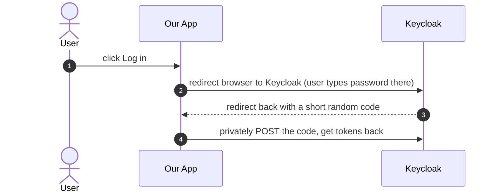
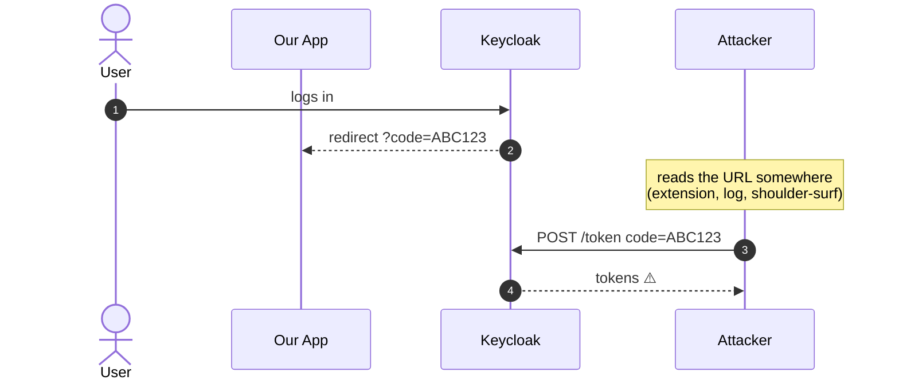
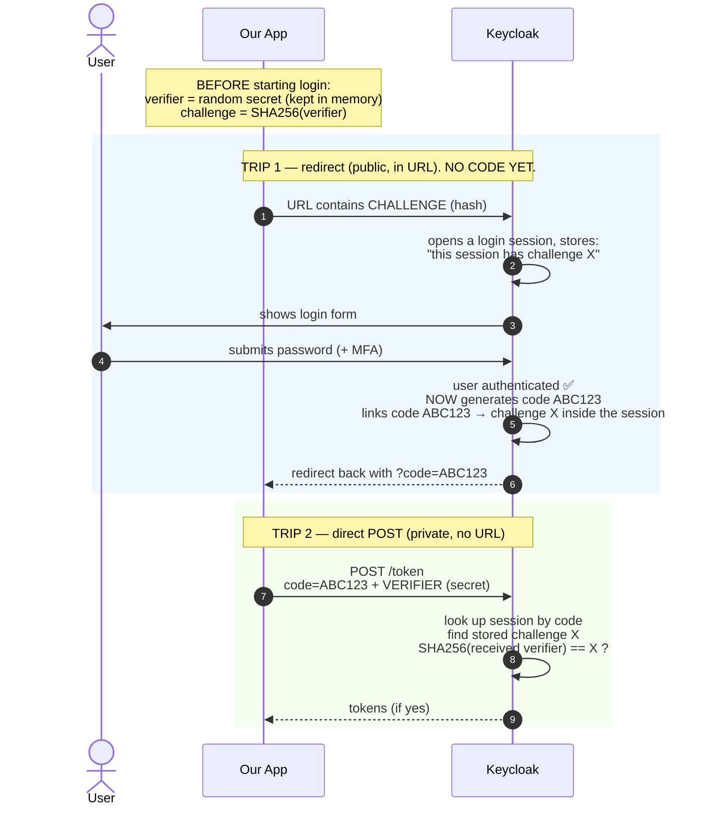
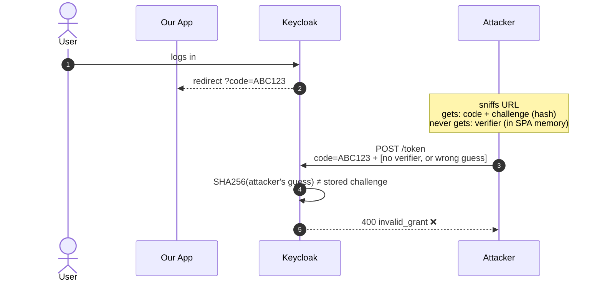
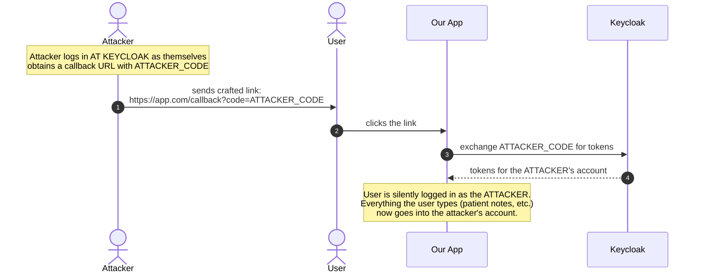
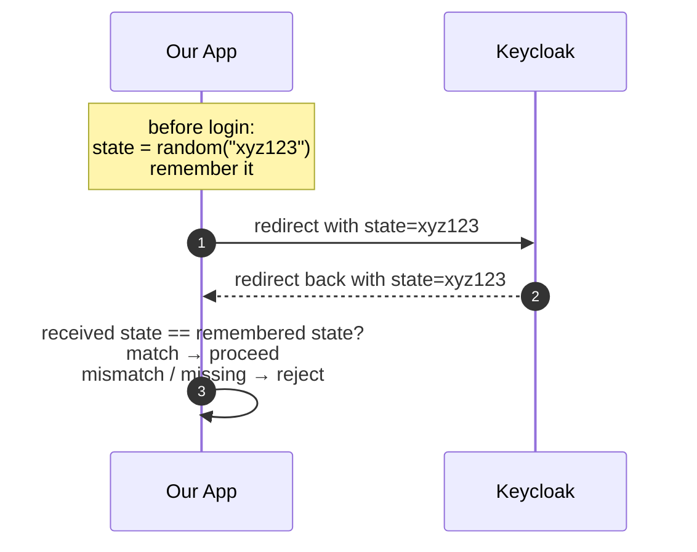
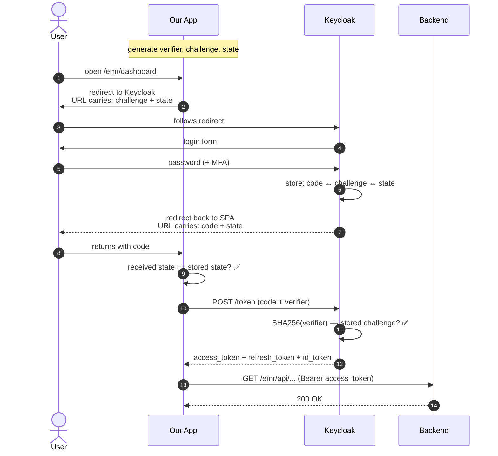
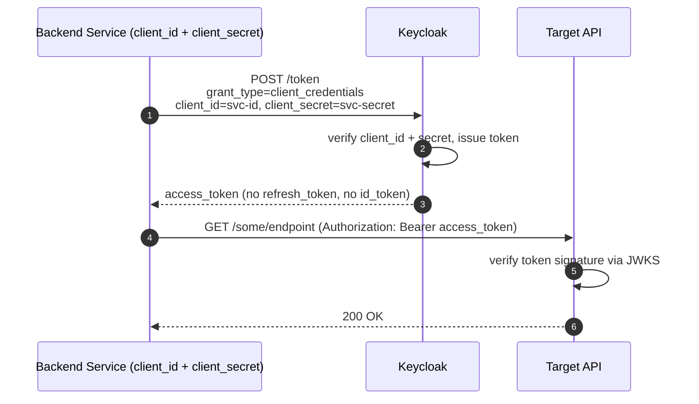
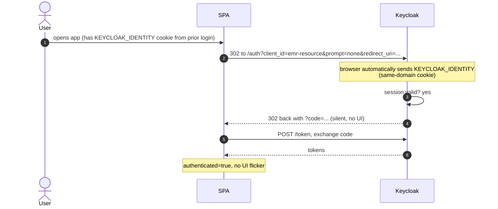

# Keycloak — Identity & Access for the EMR App

Standalone reference. Start here if you are new to Keycloak or to identity management in general. For the *flow* of how a user actually lands on a page after login, go to `flows/login.md` — that doc assumes the concepts introduced here.

## Contents

1. [What is IAM?](#1-what-is-iam)
2. [What is Keycloak?](#2-what-is-keycloak)
3. [OAuth 2.0 — the authorization framework](#3-oauth-20--the-authorization-framework)
4. [OpenID Connect — identity on top of OAuth 2.0](#4-openid-connect--identity-on-top-of-oauth-20)
5. [How Keycloak packages it all together](#5-how-keycloak-packages-it-all-together)
6. [How our EMR app uses Keycloak, feature by feature](#6-how-our-emr-app-uses-keycloak-feature-by-feature)
7. [Features available but not yet used](#7-features-available-but-not-yet-used)
8. [Glossary](#8-glossary)

---

## 1. What is IAM?

**IAM = Identity and Access Management.** It's the discipline (and the set of tools) that answers two questions for every request to a system:

1. **Authentication (AuthN)** — *who is this user?* Proving identity, typically via password, MFA, certificate, biometric, etc.
2. **Authorization (AuthZ)** — *what are they allowed to do?* Mapping identity to permissions.

A good IAM system does more than just login:

- **User lifecycle** — creation, onboarding, password reset, role changes, deactivation, deletion.
- **Credential storage** — hashing, salting, rotation, history.
- **Session management** — how long a login lasts, single sign-on across apps, idle timeout.
- **Policy enforcement** — role-based access control (RBAC), attribute-based (ABAC), group membership.
- **Audit** — who logged in, from where, when, what failed, what was changed.
- **Federation** — integrating external identity sources (LDAP, Active Directory, Google, Facebook, hospital SSO).
- **Standards compliance** — OAuth 2.0, OIDC, SAML, so every consumer (web apps, mobile apps, CLI tools, APIs) can talk the same protocol.

### Why centralize IAM?

Before dedicated IAM servers, every app wrote its own login page, stored its own passwords, and made its own policy decisions. That approach doesn't scale:

- Each app becomes an attack surface for credential theft.
- Users juggle a different password per app.
- Password reset flows, MFA, lockouts have to be rebuilt everywhere.
- Offboarding a user means remembering to delete them from every system.
- Compliance audits become spelunking expeditions.

Centralized IAM inverts that: **the app stops being an authority on identity**. It trusts a single source (a **token** issued by the IAM server) and checks the token on every request. Users get one login. Operators get one console to grant, revoke, or audit access.

---

## 2. What is Keycloak?

**Keycloak is an open-source IAM server** originally built by Red Hat. It implements the common standards (OAuth 2.0, OIDC, SAML 2.0) and ships with:

- A login page (themable).
- A **user database** (or connection to LDAP/AD).
- An **admin console** for managing users, roles, groups, clients, realms.
- A **session store** (SSO cookies across all apps that use this Keycloak).
- A **token issuer** (signs JWTs with its private key; publishes its public key for verifiers).
- Built-in MFA, password policies, account lockout, brute-force detection, password reset emails.
- An **Account Console** where users can manage their own profile, sessions, and credentials.
- Admin REST APIs (for automated user provisioning from our backend).

### Keycloak's mental model

Keycloak organizes things in a hierarchy:

```
Keycloak server
 └─ Realm                  ← isolated "tenant" (users, roles, settings don't cross)
     ├─ Users               ← people
     ├─ Roles               ← labels attached to users
     ├─ Groups              ← collections of users (optional)
     ├─ Clients             ← applications that ask Keycloak "who is this user?"
     │   └─ Client roles    ← roles scoped to a single client (optional)
     ├─ Identity providers  ← external federation (Google, LDAP, SAML)
     └─ Authentication flows ← customizable login/reset/verify pipelines
```

**Realm.** A realm is a hard isolation boundary. A user in realm A cannot log into realm B — they're separate user bases with separate token signing keys. A single Keycloak deployment can host many realms (e.g. one per tenant, one per environment).

**Client.** Every application that integrates with Keycloak is registered as a client. The client definition tells Keycloak:
- What kind of app it is (browser SPA, server-side web, mobile, backend service).
- Which redirect URIs are allowed (to prevent phishing).
- What tokens it can receive and how long they last.
- Whether it's "public" (no secret — SPAs/mobile) or "confidential" (has a secret — servers).

**Role.** The unit of authorization. Can be defined at realm level ("admin", "doctor") or client level ("emr-resource:billing-manager"). Our app uses **realm roles** exclusively.

---

## 3. OAuth 2.0 — the authorization framework

OAuth 2.0 is the standard for **delegated authorization**: letting an application act on a user's behalf with limited, auditable access, without the user handing over their password.

Core idea: instead of "here is my password, go do things," the user says "I authorize this app to do X on my behalf" and the IAM server hands the app a **token** that represents that authorization.

### 3.1 The four roles

OAuth 2.0 defines four roles (don't confuse them with user-permission roles — these are protocol participants):

| Role | In our app |
|---|---|
| **Resource Owner** | The human user |
| **Client** | The Angular SPA (`emr-resource`) |
| **Authorization Server** | Keycloak (realm `COB`) |
| **Resource Server** | The EMR backend API |

### 3.2 Grant types (flows)

OAuth 2.0 is a framework, not a single recipe. A **grant type** is a named recipe for how a client obtains a token. The recipe changes based on whether a human user is involved and whether the client can hold a secret.

Two grant types matter today:

- **Authorization Code + PKCE** — human user in the browser. A user opens the app, logs in at Keycloak, app gets tokens scoped to that user.
- **Client Credentials** — no user. A backend service proves its own identity to Keycloak and gets a token to call another backend.

Legacy grants (Implicit, Resource Owner Password) exist but are deprecated for modern SPAs. Don't use them.

Each gets a full section below. § 3.3 covered Authorization Code + PKCE. § 3.4 covers Client Credentials. § 3.5 puts them side by side.

### 3.3 Authorization Code + PKCE, step by step

Take this section slowly. Each subsection adds one small idea on top of the previous one. By the end each piece has a clear role.

#### 3.3.1 Three small things you need to know first

Before any diagram, three mini-concepts:

**1. What a "redirect" is.** When a web server tells the browser "don't load this page — go load *that* page instead." The browser obeys. The server can include extra info in the new URL (e.g. `https://app.com/callback?code=XYZ`). That URL is visible to the user, to browser extensions, and gets written to proxy logs.

**2. Our app and Keycloak live on different websites.** Our app is served from something like `https://emr.example.com`. Keycloak lives at `https://kc-cob.example.com`. Two different domains. When we say "the user logs in via Keycloak," we literally mean the browser navigates over to the Keycloak website, the user types a password **on Keycloak's page**, and Keycloak then redirects the browser back to our app. Our app never sees the password.

**3. Tokens.** Tokens are what the app actually wants — signed strings that let it call the backend. Everything before the app has tokens is "setup."

With those three things in mind, the flow gets much easier to picture.

#### 3.3.2 The whole flow in 4 moves



Two halves:

- **Half 1 — through the browser.** Steps 2 and 3 are redirects. Info exchanged this way travels in the URL. Public.
- **Half 2 — direct, not through the browser.** Step 4 is a normal HTTPS POST the SPA makes. Body, not URL. Private.

**Why split it?** Because URLs leak (history, logs, extensions). We don't want **tokens** in a URL. So Keycloak hands us a disposable **code** in the URL, and we trade it for **tokens** through the private channel.

#### 3.3.3 What is the authorization code, really?

It's just a random string that Keycloak generates after the user successfully logs in. For example:

```
code = MvoVDu12iC1_abc_def_ghi_jkl_mno_pqr
```

Three properties:

- **Short-lived** — valid for 60 seconds (Keycloak default).
- **One-time** — using it once marks it used. A second use fails.
- **Single purpose** — only good for one thing: trading for tokens at Keycloak's `/token` endpoint.

**Think of it as a numbered paper ticket** for a bag check:

- After you hand over your bag (password), the attendant gives you a numbered ticket.
- The ticket is not your bag. Losing it on the floor doesn't give anyone your stuff directly.
- But if someone **grabs your ticket and runs to the counter first**, they can walk off with your bag.

The last problem is what PKCE fixes. We're not there yet — just remember the code is a disposable ticket that, on its own, isn't useless to thieves.

#### 3.3.4 The risk: somebody steals the code from the URL

When Keycloak sends the code back, the browser sees a URL like:

```
https://app.example.com/emr/dashboard?code=ABC123
```

That URL is **visible**. A malicious browser extension, a logging HTTP proxy, or even the browser history can capture it. If someone captures the code before our app exchanges it, they can race us:



For **server-side apps** (like a Java web app running behind a server), this attack is stopped by a shared secret: when the server exchanges the code, it also sends a `client_secret` only it and Keycloak know. An attacker without the secret can't complete the exchange.

Our Angular app is different. All its code ships to the browser — anyone can download the JS bundle and look inside. It **cannot hold a secret**. So the "shared secret" defense isn't available.

**PKCE is what we use instead of a shared secret.**

#### 3.3.5 The key idea of PKCE, in one picture

Imagine you lock a box with a combination lock you invent on the spot:

1. You lock the box and photograph the closed lock. You send the photo to the guard and keep the combo.
2. Later you come back. The guard says "open the lock on your box and I'll give you what's inside."
3. You spin in the combo, the lock opens, the guard compares the open lock with the photo, all good → you get your stuff.

An attacker along the way could steal the photo. It doesn't help them — they still don't know the combo. The combo was never outside your pocket.

**PKCE is exactly that, but with hashes instead of locks:**

- **Combo** = `code_verifier` (a random secret you make up).
- **Photo of the locked state** = `code_challenge` (a SHA-256 hash of the combo).

The challenge (photo) travels through the URL. The verifier (combo) never does.

#### 3.3.6 `code_verifier` and `code_challenge` — what they are

| Name | What it is | Where it goes |
|---|---|---|
| `code_verifier` | A **random secret string** the app generates right before login (43–128 chars). Example: `"dBjftJeZ4CVP-mB92K27uhbUJU1p1r_wW"` | **Stays in the app's memory. Never in any URL.** |
| `code_challenge` | The **SHA-256 hash** of the verifier. Example: `"E9Melhoa2OwvFrEMTJguCHaoeK1t8URW"` | Sent to Keycloak through the redirect URL. |

Critical fact about hashes: **one-way.** Given a SHA-256 output, there is no known way to compute back the input. The attacker who sees the challenge (the hash) cannot derive the verifier. Brute-forcing a 43-character random string is infeasible.

So the rule is:
- The **app** knows both (it generated the verifier and computed its hash).
- **Keycloak** sees only the challenge at first, and stores it.
- The **attacker** at best sees the challenge (from the URL). Never the verifier.

#### 3.3.7 How the two values actually move between app and Keycloak

The flow has **two trips** from app to Keycloak. The verifier and challenge each appear in exactly one of them. Importantly, **the code doesn't exist yet during Trip 1** — Keycloak only creates it *after* the user successfully logs in.



Read it like this:

- **Trip 1, before login** — the app sends the **challenge (hash)** in the URL. Keycloak opens a login session and remembers the challenge inside it. **There is no code yet.**
- **Still Trip 1, after login** — the user types their password. Keycloak authenticates them and only now **creates a random code**, linking it to the challenge it stored earlier. Keycloak redirects the user back to the app with the code in the URL.
- **Trip 2** — the app sends the **code + verifier** in a private POST. Keycloak uses the code to find the right session, reads the challenge it remembered, hashes the received verifier, and checks they match.

So the code and the challenge never travel together on the wire. They meet only **inside Keycloak's memory**, right after the user successfully logs in.

The verifier **never** travels through the URL. The challenge **always** travels through the URL. Remembering that one sentence is enough to reason about the whole thing.

#### 3.3.8 Now run the attack again — PKCE wins



The attacker has everything from the URL — code, challenge — but **not the verifier**. Without it, there is nothing to feed into Keycloak's hash-and-compare check. The exchange fails.

#### 3.3.9 "But the attacker captured BOTH the code and the challenge — why can't they just send both?"

This is the sharpest question people ask when first learning PKCE. Let's walk through it precisely.

Suppose the attacker has:
- `code = ABC123` (captured from the return redirect URL)
- `challenge = E9Melhoa2...` (captured from the outgoing redirect URL)

They build the POST:

```
POST /token
  grant_type=authorization_code
  code=ABC123
  code_verifier=E9Melhoa2...     ← they paste the challenge in here
```

Keycloak's check is **not** "does the received value equal the stored challenge?" It's:

> Does `SHA256(received code_verifier) == stored challenge`?

Keycloak **hashes whatever you submit as `code_verifier`**, then compares to what it stored. Walk through it:

```
Attacker's submitted code_verifier = "E9Melhoa..."
Keycloak runs SHA256 on it:
  SHA256("E9Melhoa...") = "8f4c39d..."   (some other hash)

Stored challenge (from Trip 1) = "E9Melhoa..."

Compare:   "8f4c39d..." == "E9Melhoa..."   ❌
```

Hashing something a second time gives a different result. For the check to pass, the attacker would need to submit a value **X** such that `SHA256(X) == stored challenge`. Finding such an X means reversing SHA-256, which is computationally infeasible.

Table of every attempt the attacker could make:

| Attacker sends as `code_verifier` | Keycloak computes | Comparison | Result |
|---|---|---|---|
| **verifier** (the original secret) | `SHA256(verifier) == stored challenge` | ✅ | tokens — but the attacker never had the verifier |
| **challenge** (pulled from the URL) | `SHA256(challenge) != stored challenge` | ❌ | fail |
| empty string | `SHA256("") != stored challenge` | ❌ | fail |
| any random guess | `SHA256(guess) != stored challenge` | ❌ (astronomical odds) | fail |

**Core rule:** the `/token` endpoint expects the **original secret**, never the hash. Keycloak hashes what arrives and compares to what it stored. Because SHA-256 is one-way, no amount of information from the URL lets the attacker construct a matching secret.

Also worth noting: **the verifier in Trip 2 is sent as plain text** (not hashed again), inside the POST body. That's safe because:

- HTTPS encrypts the POST body end-to-end.
- POST bodies are **not** recorded in browser history, URL logs, or proxy access logs — URLs are.
- The verifier is used once and discarded; the code is single-use and ~60 s valid.

So Trip 1 carries the hash through a channel that may leak (URL). Trip 2 carries the plain secret through a channel that doesn't (POST body over HTTPS). That asymmetry is the point.

#### 3.3.10 How do app and Keycloak agree that the hash is SHA-256?

If the app hashes and Keycloak hashes, how do they both know to use SHA-256? It's not an assumption. The app **declares** it explicitly in Trip 1 via a parameter called `code_challenge_method`.

Look at the real redirect URL, with this parameter visible:

```
https://kc-cob.example/realms/COB/protocol/openid-connect/auth
  ?client_id=emr-resource
  &response_type=code
  &code_challenge=E9Melhoa2...
  &code_challenge_method=S256         ← "I used SHA-256"
  &state=xyz123
  &redirect_uri=...
```

Keycloak reads `code_challenge_method=S256` and stores it next to the challenge in the login session. At Trip 2, Keycloak uses **the same method** to hash the arriving verifier. No assumption, no mismatch.

RFC 7636 allows two values:

| Value | Meaning | Use? |
|---|---|---|
| `S256` | SHA-256 | ✅ Always |
| `plain` | No hash — the challenge literally equals the verifier | ❌ Legacy fallback, defeats PKCE |

If `code_challenge_method` is omitted, Keycloak defaults to `plain` — which is as if PKCE weren't there at all. So the method must always be set explicitly.

**Three enforcement layers keep it at `S256` in our setup:**

1. **`keycloak-js` always sends `S256`.** We never write this by hand.
2. **Keycloak client config:** on the `emr-resource` client, the "Proof Key for Code Exchange Code Challenge Method" is set to **S256**. Keycloak rejects any login that uses `plain` or omits the method.
3. **PKCE required:** the client is configured so that a login attempt without *any* challenge is rejected outright.

So the algorithm is negotiated by the app in Trip 1 and **enforced on the Keycloak side** — belt and suspenders.

#### 3.3.11 What is the `state` parameter?

`state` defends against a **different attack from PKCE**. Keeping the two attacks separate in your head is the hardest part — and the most common source of confusion.

##### 3.3.11.1 Two different attacks

| Attack | Whose code is used? | Defended by |
|---|---|---|
| **Code theft** — attacker steals the user's code from the URL and exchanges it for the user's tokens | **the user's** | **PKCE** |
| **Code injection** — attacker tricks the user into exchanging the *attacker's* code, so the user ends up logged in as the attacker | **the attacker's** | **`state`** |

PKCE and `state` protect against different ends of the same pipeline. Both are needed.

##### 3.3.11.2 How the injection attack works



The attacker never touches the user's credentials. They just make the user finish a login the attacker started. Once the user is logged in as the attacker, the user's data ends up in an account the attacker controls.

##### 3.3.11.3 How `state` blocks it

`state` is a random string the app generates **before** redirecting to Keycloak. The app remembers it (in memory or `sessionStorage`). Keycloak echoes it back unchanged in the callback. On return, the app compares the received `state` to what it stored.



In the injection attack above, the attacker's crafted URL has the **attacker's** state (or none). The user's own app stored the **user's** state (or nothing, if the user never started a login). Either way the values don't match → rejected.

##### 3.3.11.4 "But can't the attacker just grab the user's state from the URL?"

Very good instinct — and a common confusion. Walk through what it would take.

For the attacker to learn the user's `state`, they'd need to:

1. **Read the user's URL in real time.**
   - From the network? No — HTTPS encrypts the URL path + query. Network attackers see only the destination host.
   - From another website? No — same-origin policy prevents site A from reading site B's URL bar.
   - From the user's browser itself? Only if the attacker has already compromised the browser (malicious extension, local malware). At that point the attacker can steal much more than `state`.
2. **Inject a crafted callback before the user's real callback arrives** — seconds of timing window.

`state` is not meant to beat a fully compromised browser. It's meant to beat the **cheap, scalable attack**: a **pre-made phishing link** where the attacker doesn't know anything about a particular user's session. That attack is what most OAuth-based account takeovers in the wild actually look like.

##### 3.3.11.5 PKCE as a second line of defense

Even in the exotic scenario where an attacker somehow has real-time URL access and both captures the user's `state` and injects the attacker's code with that state, **PKCE still stops them**:

- The user's app holds the user's own `code_verifier` in memory.
- When the injected callback arrives, the user's app pairs the **attacker's code** with the **user's verifier** and POSTs to `/token`.
- But Keycloak stored the **attacker's challenge** against the attacker's code.
- `SHA256(user's verifier) ≠ attacker's challenge` → `400 invalid_grant`. No tokens.

So the two protections cover each other:

| Attack variant | First-line defense | Second-line defense |
|---|---|---|
| Attacker steals user's code | PKCE | — |
| Attacker injects their code via phishing link | **`state`** | PKCE (attacker's challenge ≠ user's verifier hash) |
| Attacker captures user's state AND injects their code (real-time) | `state` first-line fails | **PKCE** (challenge/verifier still mismatched) |

##### 3.3.11.6 One-line summary

> **PKCE** makes a stolen code useless.
> **`state`** makes sure the code coming back belongs to a login **we** started.
> **`state` doesn't need to be secret** — only unpredictable per session. Its job is to defeat pre-crafted phishing links, not in-browser attackers.

Both are generated and verified automatically by `keycloak-js`. We never write this code ourselves.

#### 3.3.12 Full flow with every piece labeled

Now that each piece has its own meaning, the full picture is easy:



Legend — one line per piece:

| Piece | Travels in | Lives where (for the SPA) | Job |
|---|---|---|---|
| `code` (authorization code) | URL, coming back | received from Keycloak | one-time ticket that can be traded for tokens |
| `code_challenge` (hash) | URL, going out | derived from verifier | public half of the puzzle |
| `code_verifier` (secret) | POST body (trip 2) | SPA memory only | private answer to the puzzle |
| `state` | URL, both directions | SPA memory + URL | proves the callback belongs to a login we started |

#### 3.3.13 In our code

- PKCE + state are created and verified entirely by `keycloak-js`. We never call SHA-256 or generate random strings by hand.
- Login is triggered when `KcAuthGuard.canActivate()` calls `keycloakAngular.login({ redirectUri: ... })` for an unauthenticated user.
- The code-to-token exchange happens automatically: when the user lands back on the app with `?code=...&state=...`, `keycloak.init()` on the next bootstrap spots the URL and does the POST.
- Tokens stay in memory inside `keycloak-js`. Not in `localStorage`, not in cookies our SPA sets.
- Elsewhere in the code, you read the current access token via `keycloakService.getToken()`.

**Keycloak client settings that must be right** (realm `COB`, client `emr-resource`):

- Access Type: **Public**
- Standard Flow Enabled: ✅
- Code Challenge Method: **S256** (SHA-256). Don't use `plain`.
- Valid Redirect URIs: strict whitelist. No `*` wildcards.

#### 3.3.14 If you remember only three things

- The **authorization code** is a 60-second one-time ticket Keycloak gives us **in a URL**. We trade it for tokens via a **private POST**.
- **PKCE** = we make a random secret (**verifier**), send only its hash (**challenge**) in the URL, and later prove we know the secret. An attacker seeing the URL only sees the hash — they can't derive the secret.
- **`state`** = a random tag we send and expect back, so we only accept callbacks from a login we started ourselves.

### 3.4 Client Credentials — the backend-to-backend flow

#### 3.4.1 When you'd use it

"Client Credentials" is for calls where **no human user is involved**. Service A (a backend) needs to call Service B (another backend), and it needs to prove *it is* Service A, not that any particular person is logged in.

Common real-world examples:

- A nightly job on Service A calls Service B to sync data.
- A backend needs to call Keycloak's admin API to create/disable users.
- A microservice calls a partner API that expects OAuth 2.0 bearer tokens.

In our EMR setup today, **the frontend does not use this grant**. The Angular SPA has a user behind it, so it uses Authorization Code + PKCE. Client Credentials is relevant in the backend — for example, the EMR backend likely uses it to call Keycloak's admin API when an org admin adds a user (see § 6.4).

#### 3.4.2 The actors

Only two, plus the target API:

| Role | In a Client Credentials flow |
|---|---|
| **Client** | The backend service (confidential — can hold a secret) |
| **Authorization Server** | Keycloak |
| **Resource Server** | The API the client wants to call |
| ~~Resource Owner (user)~~ | **Not involved.** |

No human, no login page, no redirects. Just a POST.

#### 3.4.3 The flow — one trip



One direct POST. No browser, no redirects, no code to exchange.

#### 3.4.4 What makes it work

The **client secret**. Unlike a public SPA, a backend service can hold a long random secret and never expose it. The secret is the proof of identity — "I am Service A because I know Service A's secret."

How it's configured:

- In Keycloak, the client is marked **Confidential** (instead of Public).
- Keycloak gives the client a **client secret** at creation time.
- The service stores the secret securely (env variable, secret manager — never in source control).
- On each token request, the service sends `client_id + client_secret`.

#### 3.4.5 Tokens in Client Credentials

| Token | Issued? |
|---|---|
| **access_token** | ✅ |
| **refresh_token** | ❌ (not issued — just request a new access token with the secret when needed) |
| **id_token** | ❌ (OIDC concept; there's no user identity to describe) |

The access token typically has **service-level roles** attached — roles granted to the service itself in Keycloak, not user roles.

#### 3.4.6 Why this wouldn't work for our SPA

Two reasons:

1. **A public client can't hold a secret.** Our Angular bundle is downloadable JavaScript. Any secret we embedded would be instantly public.
2. **There's a user.** Tokens issued to "the SPA" (not to "user X") wouldn't let the backend enforce per-user authorization. A user-scoped flow is required.

So Client Credentials is the right tool only when (a) you can keep a secret and (b) you genuinely want to act as the service, not as any user.

### 3.5 Comparing the two grant types

Side-by-side of Authorization Code + PKCE vs Client Credentials.

| Dimension | Authorization Code + PKCE | Client Credentials |
|---|---|---|
| **Who logs in** | A human user | Nobody — a service authenticates itself |
| **Client type** | Public (SPA, mobile) | Confidential (backend service) |
| **Secret held?** | None (client secret impossible) | `client_secret` in secure config |
| **How identity is proved** | User types password at Keycloak | Service sends `client_id + client_secret` |
| **Round trips** | Two — redirect to Keycloak, then POST /token | One — POST /token |
| **Browser involved?** | Yes (redirects) | No |
| **Tokens issued** | access + refresh + id | access only |
| **Token subject (`sub` claim)** | The user's ID | The service account's ID |
| **Roles in token** | User's realm roles | Service-account roles (configured in Keycloak) |
| **PKCE needed?** | Yes (no secret to fall back on) | No (the secret replaces PKCE) |
| **`state`, `redirect_uri`** | Yes — redirect flow exists | N/A — no redirects |
| **Refresh strategy** | Use refresh_token until expires | Just ask for a new token with the secret |
| **Typical lifetime of access token** | ~5 min | Same (configurable per client) |
| **Used in our app** | SPA ↔ Keycloak (the only flow the frontend uses) | Backend ↔ Keycloak admin API (backend only) |

**Mental model:** the two flows answer different questions.

- *Auth Code + PKCE answers:* "Who is the user, and what can **they** do?"
- *Client Credentials answers:* "Which service is calling, and what can **it** do?"

A system with both is normal. Our EMR is one: the SPA uses Auth Code + PKCE to act on behalf of users; the backend uses Client Credentials to call Keycloak's admin API when provisioning new accounts.

### 3.6 Tokens

An **access token** is a bearer credential: whoever holds it can use it. It must be protected (never log it, never send it to an untrusted origin). Keycloak issues access tokens as **JWTs** (JSON Web Tokens) — a base64-encoded JSON body with a cryptographic signature. Example content (decoded):

```json
{
  "sub": "8f4e-...",                         // subject: unique user ID
  "preferred_username": "dr.smith",
  "email": "dr.smith@clinic.com",
  "given_name": "John",
  "family_name": "Smith",
  "realm_access": {
    "roles": ["user-role", "medical-note-role", "finalize-medical-note-role"]
  },
  "iss": "https://kc-cob.../realms/COB",     // issuer
  "aud": "account",                          // audience
  "azp": "emr-resource",                     // authorized party (our client)
  "iat": 1712900000,                         // issued-at (Unix seconds)
  "exp": 1712900300,                         // expires-at
  "jti": "..."                               // token ID (for revocation)
}
```

Access tokens are **short-lived** (Keycloak default: 5 minutes). Keeping them short limits the blast radius of a leak.

A **refresh token** is longer-lived (default: 30 min, extendable up to Keycloak's SSO session idle/max). The client sends it to the token endpoint to get a new access token without bothering the user. Refresh tokens are also revocable — an admin can log a user out of every device.

An **ID token** is defined by OIDC (next section), not OAuth 2.0 proper. OAuth 2.0 alone is silent on identity; it only says "this token grants access." OIDC adds "and here is who the user is."

### 3.7 Scopes

OAuth 2.0 tokens can carry **scopes** — named permissions (e.g. `openid`, `profile`, `email`, or app-specific `billing:write`). Clients ask for scopes at login time; Keycloak either grants them (based on admin config) or drops them. Our app uses the standard OIDC scopes (`openid profile email`) — scopes are **not** the main authorization mechanism here; roles are.

---

## 4. OpenID Connect — identity on top of OAuth 2.0

Start with this plain-English version. The subsections below go deeper if you want it — but read this intro first and make sure it clicks before moving on.

#### The simplest way to explain it

Imagine you're building an app. When a user logs in, your app has **two different needs**:

1. **Call the backend API** — fetch patient records, save a note, etc.
2. **Show the user's name** in the top-right corner — "Hi, Dr. Smith".

These are two different things:

- #1 needs **permission** → "is this call allowed?"
- #2 needs **identity** → "what's this person's name?"

**OAuth 2.0 by itself only covers #1.** It was invented for one specific job: *"let this app call an API on behalf of a user, without the user giving the app their password."* So it hands back a **permission token** (the access token). It does not tell the app the user's name or email. If the app needs the name too, OAuth 2.0 alone leaves it stuck.

**OpenID Connect is just "OAuth 2.0, plus also tell me the user's name."** It's a small add-on. When a user logs in with OIDC, the app gets back **two things instead of one**:

- The same permission token (access token) — for calling the API.
- **Plus** a second small packet called the **ID token**, containing the user's name, email, and unique ID.

That's the whole difference. OIDC = OAuth 2.0 + the user's identity info delivered alongside.

#### Security guard analogy

You walk into an office building. The front desk verifies who you are. They give you:

- A **wristband** (access token) — the elevator and door scanners read it to decide what floors you can access.
- A **name badge** (ID token) — printed with "John Smith" so everyone in the building can greet you by name.

**Before OIDC**, the front desk only gave wristbands. You could use the elevators, but you had nothing with your name on it. If an app wanted to greet you by name, it had to make a separate trip back to the front desk — *"hey, whose wristband is this?"* — which was clunky and non-standard.

**OIDC** says: "when you hand out the wristband, also print a name badge." Two items, one visit.

#### In one line

> **OIDC = OAuth 2.0 + a signed packet of the user's identity (the ID token), issued at the same moment as the access token.**

Everything else in this section is detail about that one idea — how the ID token is structured, what claims it carries, how the SPA reads it, and how it differs from the access token.

---

Technical detail of what OIDC adds on top of OAuth 2.0:

- An **ID token** — the "name badge."
- A standard set of identity claims (`sub`, `email`, `given_name`, `family_name`, `name`, ...).
- A **UserInfo endpoint** for fetching fresh identity claims later.
- A **Discovery document** at a well-known URL listing every endpoint and public key.
- The magic scope **`openid`** — requesting this scope during login is what tells Keycloak "issue an ID token too, not just an access token."

### 4.1 ID token vs access token — the part that confuses everyone

#### 4.1.1 The problem OIDC solved

Before OIDC, if you wanted to log a user in using OAuth 2.0, you'd do this:

1. Complete the Authorization Code flow → get an access token.
2. Use the access token to call a separate `/userinfo`-style endpoint to find out who the user is.

This was clunky. Every provider had its own URL, its own response format, its own claim names. You couldn't write a single "log in with OAuth" library.

**OIDC's fix:** issue a second token **at the same time** as the access token — one specifically for the client to read, with a standard set of identity claims, in a standard format (JWT). That second token is the **ID token**.

#### 4.1.2 Two tokens, two audiences

When you log in via OIDC, Keycloak returns **both** tokens in the same `/token` response:

```
POST /token ... → {
  "access_token":  "eyJ...",
  "id_token":      "eyJ...",
  "refresh_token": "eyJ..."
}
```

Both are JWTs. Both are signed by Keycloak's private key. They may even look similar inside (we'll show why). But they exist for different readers with different jobs.

| | ID Token | Access Token |
|---|---|---|
| **Who is it for?** | **The client app (our SPA).** Reads it to know who just logged in. | **The backend API.** Reads it to decide if the call is allowed. |
| **What does it mean?** | "An authentication just happened. Here is who logged in." | "The bearer of this token may call the API." |
| **`aud` (audience) claim** | The client ID (`emr-resource`) | The API identifier (e.g. `account`) |
| **Where does it travel?** | **Stays with the SPA.** Never sent to the backend. | **Sent on every API call** as `Authorization: Bearer ...` |
| **Used for UI display?** | ✅ yes — name, email, avatar | ❌ no (strict OAuth 2.0 says the SPA shouldn't even parse it) |
| **Used for authorization?** | ❌ no | ✅ yes — backend reads roles, permissions |
| **Introduced by** | OpenID Connect (2014) | OAuth 2.0 (2012) |

**One-sentence rule:**

> **The access token is a key to the API. The ID token is a signed receipt telling the SPA who logged in.**

#### 4.1.3 Hotel analogy

You check into a hotel:

- The front desk (Keycloak) verifies your ID.
- They hand you a **key card** (access token). Every door scanner and amenity check reads the key card.
- They hand you a **printed receipt** (ID token) with your name, check-in time, and room number.

Same moment, two objects, different purposes:

- The **key card** is for the locks. You hand it to the bellman so he can open your room. It's meaningful to the doors.
- The **receipt** is for you. You glance at it to remember "I'm in room 204." The doors never see it.

If you lose the receipt, doors still work — you've just forgotten your own check-in details. If you lose the key card, you still have proof you checked in, but you can't open anything.

#### 4.1.4 What's inside each — concrete examples

**ID token** (decoded). Intended for the SPA:

```json
{
  "iss":  "https://kc-cob.../realms/COB",
  "aud":  "emr-resource",                 ← audience: OUR SPA
  "sub":  "8f4e-...",
  "auth_time": 1712900000,                ← when the user authenticated
  "name": "John Smith",
  "given_name":  "John",
  "family_name": "Smith",
  "email": "john@clinic.com",
  "email_verified": true,
  "preferred_username": "dr.smith",
  "iat": 1712900000,
  "exp": 1712900300
}
```

Notice: no `realm_access.roles`, no permissions. Pure identity.

**Access token** (decoded). Intended for the backend API:

```json
{
  "iss":  "https://kc-cob.../realms/COB",
  "aud":  "account",                      ← audience: the BACKEND
  "sub":  "8f4e-...",
  "realm_access": {
    "roles": ["user-role", "medical-note-role"]
  },
  "scope": "openid profile email",
  "iat": 1712900000,
  "exp": 1712900300
}
```

Notice: has **roles**. About *what the bearer can do*, not *who they are*.

#### 4.1.5 But why do they look similar in Keycloak?

In strict OAuth 2.0, access tokens are **opaque** (just identifiers the API can look up server-side). Keycloak — like most modern OPs — makes them JWTs and adds identity claims (`name`, `email`) to them too, because it's convenient for backends that want both identity and authorization in one place.

So in Keycloak-land the two tokens often **look** similar. The **`aud` claim is what actually distinguishes them** — it tells each reader "this token is for me." The SPA reads the one with `aud = emr-resource`; the backend reads the one with `aud = account`.

Don't use the fact that they look similar to conclude "one of them is redundant." They have **different semantic roles** — one is an authentication receipt, the other is an access credential. Some clients will only get one or the other depending on what they asked for.

#### 4.1.6 Why have two at all?

Three practical reasons:

1. **Different readers.** The SPA wants identity info. The backend wants authorization info. Separating lets each token be shaped for its reader.
2. **Access tokens travel further.** An access token may be sent to many APIs. You don't want it leaking unnecessary identity claims into every backend.
3. **Some clients only need one.** A pure "show me my profile" app might only get an ID token and never call an API. A machine-to-machine service (Client Credentials) gets only an access token, no ID token (no user to identify).

#### 4.1.7 In our app

- **Access token** → `AuthInterceptor` attaches it to every `/emr/api/*` call. The backend validates the signature and reads `realm_access.roles` to authorize the action.
- **ID token** → read by `KcAuthService.getLoggedUser()` via `keycloakService.getKeycloakInstance().idTokenParsed`. That's where the sidebar gets the user's name to display.
- **Refresh token** → managed internally by `keycloak-js` to get new access + ID tokens when they expire.

#### 4.1.8 If you remember only this

> Both tokens are issued at the same moment. The **access token** is for the **backend** (says what you can do). The **ID token** is for the **SPA** (says who you are). Each has its own `aud`, its own purpose, its own reader. They travel together, but they have different jobs.

### 4.2 UserInfo endpoint

`GET /realms/COB/protocol/openid-connect/userinfo` with `Authorization: Bearer <access token>` returns the user's claims as fresh JSON. Our app calls this via `keycloak.loadUserInfo()` inside `LoggedInService` to get the `sub` claim (the unique user ID) for the backend lookup.

### 4.3 Discovery

`https://<keycloak>/realms/COB/.well-known/openid-configuration` returns a JSON document listing:

- All the endpoints (`authorization_endpoint`, `token_endpoint`, `userinfo_endpoint`, `end_session_endpoint`, `jwks_uri`).
- Supported grant types, scopes, algorithms.
- The URL to fetch the signing keys (JWKS).

`keycloak-js` fetches this at init and configures itself. Backends typically cache the JWKS to validate token signatures without hitting Keycloak on every request.

### 4.4 The SSO session cookie

The cookie is what makes "log in once, stay logged in everywhere" actually work. Worth understanding in detail because it's the piece people most often misunderstand.

#### 4.4.1 What's a cookie, in this context?

A cookie is a small key-value pair the browser stores and automatically attaches to future requests **to the same domain**. It has attributes that control its scope and safety:

| Attribute | What it does |
|---|---|
| `Domain` | Which host can read the cookie. A cookie set by `kc-cob.example.com` is **only** visible to that host — not to `app.example.com`, not to our SPA. |
| `Path` | Which URL paths on that host get the cookie. |
| `Secure` | Cookie is only sent over HTTPS. |
| `HttpOnly` | JavaScript **cannot read** the cookie via `document.cookie`. Only the browser and the server see it. Blocks XSS theft. |
| `SameSite` | Controls whether the cookie is sent on cross-site requests (`Strict`, `Lax`, `None`). Limits CSRF. |
| `Max-Age` / `Expires` | How long the browser keeps it. |

Keycloak's SSO cookies are set with `HttpOnly`, `Secure`, `SameSite=None` (so they work across the cross-domain redirect), and scoped to Keycloak's own domain.

#### 4.4.2 Which cookies Keycloak actually sets

When a user completes login at Keycloak, Keycloak sets a handful of cookies **on Keycloak's own domain only**. The main ones:

| Cookie | Purpose |
|---|---|
| `KEYCLOAK_IDENTITY` | The authoritative session identifier. JWT-like blob referencing the user's SSO session on the Keycloak server. |
| `KEYCLOAK_SESSION` | Non-HttpOnly helper readable by the login iframe trick (not used by us — we set `checkLoginIframe: false`). Contains realm, user, session id. |
| `AUTH_SESSION_ID` | Binds the user's current authentication attempt to a specific Keycloak node (for stickiness in clustered deployments). |
| `KC_RESTART` | Transient, used if an auth flow needs to restart mid-way. |

**Important: these cookies live on the Keycloak domain, not ours.** Our SPA cannot read them — nor should it want to. The SPA has its own in-memory tokens; the cookies are the server-side proof of "this browser has an active session with Keycloak."

#### 4.4.3 How `check-sso` uses the cookie

Our app calls `keycloak.init({ onLoad: 'check-sso' })` at boot. In plain terms, `check-sso` means: *"Quickly ask Keycloak if this browser already has a session. If yes, grab tokens for me silently. If no, just tell me and I'll let the user keep browsing until they hit a guarded route."*

Mechanically, `keycloak-js` checks via a redirect to Keycloak's authorization endpoint with `prompt=none`:



If the cookie is missing or expired, Keycloak responds with `302 ?error=login_required` and the SPA treats the user as unauthenticated — no login page shown yet; that happens only when they hit a guarded route.

#### 4.4.4 Walking through SSO across two apps (conceptual)

Suppose we add a second application — say, a billing portal — to the same `COB` realm:

1. User opens EMR, logs in. Keycloak sets `KEYCLOAK_IDENTITY` on its domain.
2. User clicks a link to the billing portal (separate domain, say `billing.example.com`).
3. Billing portal's SPA boots with `onLoad: 'check-sso'`.
4. Browser redirects to Keycloak with `prompt=none`. Browser attaches `KEYCLOAK_IDENTITY` automatically.
5. Keycloak recognizes the session and redirects back to the billing portal with a fresh authorization code.
6. Billing portal exchanges the code for its own tokens.
7. User is now logged into the billing portal without typing a password.

That's SSO. The "sign-on" happened once; every subsequent app benefits.

**Today our app is the only client in the `COB` realm**, so this is latent — but the infrastructure is in place. Adding a second app doesn't require code changes in either one: register it as a client in Keycloak and `check-sso` just works.

#### 4.4.5 Single Log-Out (SLO)

The flip side: when a user logs out, we want them logged out everywhere.

Calling `keycloak.logout(redirectUri)` hits `GET /realms/COB/protocol/openid-connect/logout?...`. Keycloak does three things:

1. Invalidates the user's SSO session server-side (so refresh tokens stop working).
2. Clears the SSO cookies in the browser (`Set-Cookie` with `Max-Age=0`).
3. Redirects back to `redirectUri`.

Any other app that tries `check-sso` afterwards sees no cookie → unauthenticated → has to log in again.

For OIDC-compliant back-channel or front-channel logout propagation (where Keycloak actively notifies other logged-in apps), additional client configuration is needed. Our app only needs the basic single-session logout.

#### 4.4.6 What happens if the browser blocks cookies?

Keycloak's SSO cookies are cross-domain relative to our SPA (Keycloak's domain ≠ app's domain). Modern browsers with strict third-party cookie policies (Safari ITP, Firefox Total Cookie Protection, Chrome's upcoming Privacy Sandbox) may block them in some scenarios:

- **Same-site redirects work fine.** The primary Authorization Code flow uses full-page redirects, which are not "third-party" — the cookie is treated as first-party because the browser is *navigating* to Keycloak.
- **Hidden-iframe session checks break.** That's why we set `checkLoginIframe: false` — the classic keycloak-js technique of checking session status via a hidden iframe pointed at Keycloak is a third-party context and gets cookie-blocked. We refresh tokens reactively instead.
- **`check-sso` via redirect still works** because it's a navigation, not an iframe.

In short: our init options are chosen to survive aggressive browser cookie policies. If you ever re-enable `checkLoginIframe: true`, test on Safari first — it's the canary.

#### 4.4.7 Session lifetime on Keycloak's side

The SSO cookie maps to a **server-side session** in Keycloak. The session has two clocks:

- **Idle timeout** — if no token refresh / interaction for N minutes, session ends. Default 30 min.
- **Max lifespan** — absolute cap regardless of activity. Default 10 h.

Whichever fires first ends the session. Our SPA's refresh-token calls reset the idle clock; once max lifespan hits, the next refresh attempt fails and the user is bounced back to the login page.

Tuning these is a product decision:

- Short idle = safer on shared machines, worse UX.
- Long idle = smoother UX, riskier.
- Max lifespan = defense-in-depth — even an attacker who keeps the session active can only do so for this window.

### 4.5 OAuth 2.0 vs OpenID Connect — side by side

These two standards are constantly confused, and there is a reason: OIDC is built on top of OAuth 2.0 and reuses most of its machinery. Here's the clearest way to keep them apart.

#### 4.5.1 The questions they answer

- **OAuth 2.0** answers: *"Is this request authorized to call the API?"*
  Its main deliverable is an **access token**.
- **OpenID Connect** answers: *"Who is the user?"*
  Its main deliverable is an **ID token** describing identity.

OAuth 2.0 on its own has no opinion about user identity. It hands out tokens for delegated access. OIDC adds the identity layer — name, email, unique ID — so that apps can know *who* just logged in, not just that *some authorized access* happened.

#### 4.5.2 What they have in common

OIDC **reuses** almost everything from OAuth 2.0:

- Same endpoints (`/auth`, `/token`).
- Same flows (Authorization Code + PKCE is the default in both).
- Same token format (JWTs signed by Keycloak's key).
- Same grant types.
- Same clients, realms, roles.

OIDC doesn't replace OAuth 2.0. It **extends** it with a few additions:

- A new token type: **ID token**.
- A new endpoint: **UserInfo** (`/userinfo`).
- A **discovery document** (`.well-known/openid-configuration`) that publishes all endpoints + public keys.
- The special scope **`openid`** — requesting this scope at login tells the Authorization Server "this is an OIDC request; also issue an ID token."
- A standard set of identity claims (`sub`, `email`, `name`, `given_name`, ...).

#### 4.5.3 The side-by-side table

| Dimension | OAuth 2.0 (alone) | OpenID Connect |
|---|---|---|
| **Purpose** | Delegated authorization | User identity / authentication |
| **Built on** | — | OAuth 2.0 |
| **Core deliverable** | access_token | id_token (+ access_token) |
| **Tells you who the user is?** | No (access token is opaque about identity) | Yes (ID token describes the user) |
| **Uses `openid` scope?** | No | Yes (required) |
| **Issues an ID token?** | No | Yes |
| **UserInfo endpoint?** | Not defined | Yes — `/userinfo` |
| **Discovery document?** | Not defined | Yes — `.well-known/openid-configuration` |
| **Standard identity claims** | None mandated | `sub`, `email`, `name`, etc. |
| **Grant types** | All of them | Same grant types as OAuth 2.0 |
| **Age** | Published 2012 (RFC 6749) | Published 2014 |

#### 4.5.4 Mental model

Think of OAuth 2.0 as a **valet ticket system**: it hands out tokens that let someone fetch resources, without saying much about who the bearer is.

OIDC wraps that system with an **ID card**: alongside (or instead of) the valet ticket, it also gives the app a signed card saying "this person is John Smith, verified email john@example.com, unique ID 8f4e..." So the app can greet the user by name, show their avatar, and correlate with its own user database.

In practice, modern apps almost always use OIDC — because almost every app needs to know *who* is using it, not just that *someone authorized* is using it. That's why `keycloak-js` asks for `openid profile email` scopes by default.

#### 4.5.5 Which does our app use?

**Both**, via the same flow. When the SPA sends the user to Keycloak, the redirect request carries `scope=openid profile email`. That means:

- OAuth 2.0 part: Keycloak issues an **access token** so the SPA can call the backend API.
- OIDC part: Keycloak also issues an **ID token** so the SPA can read identity claims (`sub`, `email`, `given_name`, ...) without calling a separate endpoint.

Our `LoggedInService` also calls the **UserInfo** endpoint (an OIDC feature) via `keycloak.loadUserInfo()` to fetch fresh claims when needed.

One-line takeaway:

> **OIDC is OAuth 2.0 plus an identity layer.** If all you need is "can this call happen?" OAuth 2.0 alone is enough. If you also need "and by whom?" you want OIDC. Modern SPAs almost always need both.

---

## 5. How Keycloak packages it all together

Keycloak is the **Authorization Server** (OAuth 2.0 term) and the **OpenID Provider** (OIDC term). When a client is configured correctly, Keycloak handles:

1. **Login UI** — username/password (+ optional MFA, CAPTCHA, terms acceptance, required actions).
2. **Token issuance** — signs JWTs with the realm's private key.
3. **Token refresh** — the client sends a refresh token; Keycloak returns a new access token.
4. **Token revocation / logout** — the client or admin can end a session.
5. **SSO cookie** — set on Keycloak's domain so subsequent clients skip login.
6. **Public keys** — published at the JWKS URL for any verifier to fetch.
7. **Admin console + REST API** — for creating users, assigning roles, configuring flows.
8. **Account console** — where end users manage their own profile, password, MFA, active sessions.

### 5.1 Token issuance

This is what Keycloak does when it decides to hand out a token. Knowing the steps helps when debugging a token that "looks wrong."

#### 5.1.1 The eight-step pipeline

When the `POST /token` call comes in (after a successful authorization code exchange, or on a refresh):

1. **Authenticate the request.** For Authorization Code + PKCE: validate the code is fresh, not reused, redirect URI matches, verifier hashes to the stored challenge. For refresh: validate the refresh token signature and expiry, check it hasn't been revoked.
2. **Load the session.** Keycloak looks up the SSO session associated with this client + user.
3. **Resolve claims.** It gathers the user's profile (username, email, name), realm roles, client roles, group memberships, and any attributes configured on the realm.
4. **Apply protocol mappers.** Each client in Keycloak has an ordered list of "mappers" — rules like "include `realm_access.roles`," "add `email` if scope=email was requested," "add custom claim `organization_id` from user attribute X." The mappers produce the final JSON payload.
5. **Build the headers.** JWT header includes the algorithm (`alg`), the key ID (`kid`), and the type (`typ: JWT`).
6. **Serialize.** `header.payload` are base64url-encoded and concatenated with a dot.
7. **Sign.** Keycloak signs `base64(header).base64(payload)` using the realm's **private** key. Default algorithm is RS256 (RSA + SHA-256). Other supported options: RS384, RS512, ES256 (ECDSA), PS256 (RSA-PSS), HS256 (HMAC, but symmetric — avoid for realm keys). The signature is appended: `base64(header).base64(payload).base64(signature)`. That three-part dotted string is the JWT.
8. **Return.** Keycloak returns `{ access_token, refresh_token, id_token, token_type: "Bearer", expires_in, refresh_expires_in }`.

#### 5.1.2 JWT anatomy, concretely

A real access token looks like this (wrapped here for readability, actually one long string):

```
eyJhbGciOiJSUzI1NiIsInR5cCIgOiAiSldUIiwia2lkIiA6ICJub2xZZS1...
.eyJleHAiOjE3MTI5MDAzMDAsImlhdCI6MTcxMjkwMDAwMCwic3ViIjoiO...
.ZVp3Z2JJYk5pU2s4aW5OZWJXVmpFSUJXNUxoT0JQZW1hLVBGVnh...
```

Three parts separated by dots:

- **Part 1 — Header:** base64-decoded JSON, tells the verifier how to check the signature.
  ```json
  { "alg": "RS256", "typ": "JWT", "kid": "nolYe-..." }
  ```
  The `kid` matters: if Keycloak is rotating keys, it tells the verifier *which* public key to use.

- **Part 2 — Payload (claims):** the part you usually care about. See § 3.4 for our app's typical claims. **Readable without the signing key** — base64 is encoding, not encryption. **Don't put secrets in JWTs.**

- **Part 3 — Signature:** opaque binary. Tells the verifier whether parts 1+2 were mutated after Keycloak produced them.

Any JWT debugger (jwt.io, your IDE plugin) will split and decode this for you.

#### 5.1.3 Why asymmetric (private/public) instead of shared secret

Keycloak could sign tokens with HMAC (shared symmetric secret). It doesn't by default, because:

- Every backend that verifies tokens would need the secret → N copies of the same secret, any one leak compromises the whole system.
- Secret rotation requires coordinated redeploys.
- Asymmetric signing means the **public** key is, by definition, safe to publish. Backends fetch it from a public URL and cache.

So Keycloak keeps one private key (realm-scoped), and everyone else verifies with the matching public key. See § 5.3.

#### 5.1.4 Protocol mappers — how to add custom claims

Claims in the token are not hard-coded; they come from **protocol mappers** configured per client. Out of the box Keycloak includes:

- `username`, `email`, `family name`, `given name` mappers (standard OIDC claims).
- `realm roles` mapper (adds `realm_access.roles`).
- `client roles` mapper (adds `resource_access.<client>.roles`).
- `audience` mappers.
- `group membership` mappers.

You can add custom ones via the admin console:

- **User Attribute mapper** — takes a field from the user's profile (e.g. an `organization_id` attribute stored in Keycloak) and injects it as a claim.
- **Hardcoded Claim** — a constant.
- **Script mapper** — small JavaScript snippet (realm must have scripting enabled).

This is how you'd eventually push `organization_id` into every access token so the backend doesn't need to look it up per request.

#### 5.1.5 Refresh and rotation

When the SPA calls the token endpoint with `grant_type=refresh_token`:

- Keycloak validates the refresh token signature and expiry.
- Issues a new access token.
- **May** issue a new refresh token (if refresh token rotation is enabled on the client). If rotation is on, the old refresh token is invalidated on use — blunts replay attacks.

`keycloak-js` handles this entirely; our SPA only calls `getToken()` and gets back a valid access token.

---

### 5.2 SSO cookie, from Keycloak's side

§ 4.4 covered the cookie from the browser + SPA perspective. Here's what Keycloak does with it internally.

#### 5.2.1 Server-side session record

When a user finishes login, Keycloak creates a **session object** in its own database (or Infinispan cache, depending on deployment). This session record holds:

- User ID.
- Realm ID.
- List of client sessions (one per app the user has logged into under this SSO umbrella).
- Timestamps (created, last refreshed).
- IP address, user agent (for audit).

The `KEYCLOAK_IDENTITY` cookie is essentially a signed pointer to this session record. When a request arrives with the cookie, Keycloak looks up the session; no session → cookie is ignored.

#### 5.2.2 What happens on each event

| Event | Server-side effect | Cookie effect |
|---|---|---|
| Login success | Create session; create client session | `Set-Cookie: KEYCLOAK_IDENTITY=...; HttpOnly; Secure; SameSite=None; Path=/realms/COB` |
| `check-sso` hit with valid cookie | Touch session's last-refresh timestamp; issue fresh authorization code | Cookie unchanged |
| Token refresh | Touch last-refresh timestamp; emit new access token | Cookie unchanged |
| User idle beyond timeout | Next request finds session expired → delete session | Cookie still exists in browser but becomes invalid server-side; next request triggers logout |
| Explicit logout | Delete session + all client sessions | `Set-Cookie: KEYCLOAK_IDENTITY=; Max-Age=0` (browser clears) |
| Admin forces user logout | Delete session | Next refresh fails; browser's stale cookie is worthless |

#### 5.2.3 Clustered Keycloak

In a multi-node Keycloak deployment, sessions live in a shared cache (Infinispan). Any node can serve any request — but because cache invalidation has a cost, Keycloak typically routes a given session to a preferred node via the `AUTH_SESSION_ID` cookie. This is why you'll see that cookie alongside `KEYCLOAK_IDENTITY`.

For our current deployment (single-node Heroku in prod), the clustering bits are irrelevant but the cookies still appear.

---

### 5.3 Public keys (JWKS)

The part your backend cares about most.

#### 5.3.1 The core idea

Keycloak keeps a **private key** for the realm. It never leaves the server. Every JWT is signed with it.

Everyone else uses the matching **public key** to verify signatures. Public keys are, by definition, safe to publish. Keycloak publishes them at a well-known URL; anyone can fetch, no auth required.

Endpoint:

```
GET https://kc-cob.example/realms/COB/protocol/openid-connect/certs
```

Response format: **JWKS** (JSON Web Key Set, RFC 7517). An object with a `keys` array. Each entry describes one key:

```json
{
  "keys": [
    {
      "kid": "nolYe-...",           // key ID, matches JWT header.kid
      "kty": "RSA",                 // key type
      "alg": "RS256",               // signing algorithm
      "use": "sig",                 // purpose: sig (signing) or enc (encryption)
      "n": "xjlVf8Po...",           // RSA modulus (public)
      "e": "AQAB"                   // RSA exponent (public)
    }
    // older keys may still be listed here during rotation
  ]
}
```

#### 5.3.2 How verification actually works

When the backend receives `Authorization: Bearer <jwt>`:

1. Split the JWT on dots → `header_b64`, `payload_b64`, `signature_b64`.
2. Base64-decode the header. Read `alg` and `kid`.
3. Look up the public key matching `kid` in the cached JWKS.
4. Verify the signature: does `SIGN_VERIFY(alg, public_key, "header_b64.payload_b64") == signature_b64`?
5. If yes, the token is authentic. Now check the claims:
   - `iss` — does it match the expected Keycloak issuer URL?
   - `exp` — not in the past?
   - `aud` — contains our expected audience?
   - `nbf` (not-before) — not in the future?
6. If all good, trust the claims. Extract `sub`, `realm_access.roles`, etc. — those drive authorization.

**No call to Keycloak per request.** The JWKS is cached (usually for minutes to hours). That's what makes token verification cheap.

#### 5.3.3 Key rotation

Best practice: rotate the signing key periodically (weeks to months). Rotation in Keycloak works like this:

1. Admin generates a new key in the realm with "Active" priority bumped above the current one. Tokens issued from now on use the new `kid`.
2. The **old** key remains in the JWKS for a grace period — so already-issued tokens continue to verify until they expire.
3. After the grace period (or manually), the old key is removed from the JWKS.

Backends should **not** hard-code the key or `kid`. They should:

- Fetch JWKS by URL (usually via a library helper).
- Cache it with a sensible TTL (5–60 min).
- On a `kid` cache miss, re-fetch before rejecting.

If the signing key is ever suspected compromised, you can rotate **and** purge the old key immediately — every outstanding token becomes invalid on its next verification attempt.

#### 5.3.4 What happens if the backend can't reach Keycloak?

The backend needs the JWKS to verify tokens. If it cold-starts and Keycloak is unreachable, the first batch of requests will fail (token can't be verified). Two mitigations:

- **Warm cache on startup** — fetch and cache JWKS during backend boot, fail boot if unreachable (fast-fail beats serving 401s to everyone).
- **Pin the expected key** — some libraries support bundling a known key so verification works offline. Loses graceful rotation; use only as a last-resort fallback.

Worth documenting in the backend ops runbook.

#### 5.3.5 In our app

- **Where it's fetched:** the backend (Java/Spring etc. — outside this repo's scope). The backend caches the JWKS and verifies every incoming `Authorization: Bearer <jwt>`.
- **Where the frontend interacts:** the frontend does **not** verify JWTs. It trusts `keycloak-js` and relies on the backend to reject invalid tokens. The SPA only reads the token payload for UI purposes (roles, username) — never for authorization decisions that have security consequences.
- **Discovery link:** `environment.keycloak.url + '/realms/' + realm + '/.well-known/openid-configuration'` — browsing that URL tells you the current `jwks_uri`, which you then GET to see the keys. Useful when debugging.

---

### 5.4 Session vs. token lifetimes

Keycloak distinguishes three durations:

- **Access token lifetime** — default 5 min. How long a bearer token is accepted.
- **Refresh token / client session idle** — default 30 min of inactivity. If the user doesn't touch the app, they get logged out.
- **SSO session max** — default 10 h. Hard cap regardless of activity.

Tuning these is a product decision. Shorter access tokens = more refresh traffic but smaller leak blast radius. Longer SSO sessions = better UX but higher risk on shared machines.

---

## 6. How our EMR app uses Keycloak, feature by feature

| Keycloak feature | How this app uses it | Code reference |
|---|---|---|
| Realm | `COB` realm isolates our users | `environments/keycloak.config*.ts` |
| Client | One public SPA client `emr-resource` | Same |
| Realm roles | 13 roles drive UI gating & backend authorization | `modules/security/model/role.ts` |
| Authorization Code + PKCE | The login dance, handled by `keycloak-js` | `keycloak-initializer.ts` |
| ID token | Read once via `idTokenParsed` to get the current user's claims for UI display | `kc-auth.service.ts` (`getLoggedUser`) |
| Access token | Attached as `Authorization: Bearer` on every API call | `auth.interceptor.ts` |
| Refresh token | Managed automatically; `keycloak.getToken()` refreshes on demand | `user.service.ts` (`getAccessToken`) |
| UserInfo endpoint | Called to resolve the `sub` claim, which keys the backend user record | `logged-in.service.ts` |
| SSO cookie | `check-sso` init silently re-authenticates returning users | `keycloak-initializer.ts` |
| Logout endpoint | `keycloak.logout(origin)` ends the session and redirects home | `kc-auth.service.ts` |
| Admin REST API | Used by **backend** during user lifecycle (org admin creates a doctor → backend calls Keycloak admin API to create the user + assign roles). The SPA never calls admin APIs. | backend (out of scope for this doc) |

### 6.1 Realm + Client configuration (expected)

The Keycloak realm `COB` must have a client `emr-resource` configured roughly like this:

| Setting | Value | Why |
|---|---|---|
| Client type | OpenID Connect | We need OIDC |
| Access type | **Public** | SPAs can't keep a secret |
| Standard Flow | ✅ Enabled | Authorization Code + PKCE |
| Direct Access Grants | ❌ Disabled | Deprecated (would allow username/password to be POSTed) |
| Implicit Flow | ❌ Disabled | Deprecated |
| Service Accounts | ❌ Disabled | Not applicable to SPAs |
| Valid Redirect URIs | `https://<prod-domain>/*`, `http://localhost:4200/*`, `http://localhost:4300/*` | Strict whitelist to prevent phishing |
| Web Origins | `+` or explicit list | Allows CORS preflight from these origins |
| PKCE Code Challenge Method | `S256` | SHA-256, the only accepted modern option |
| Proof Key for Code Exchange | Required | Forces PKCE |

The 13 role strings in `Role` must exist as realm roles and be assignable to users.

### 6.2 The four connection points in code

Already detailed in `03-auth-and-gateway.md`, summarized here with OAuth/OIDC terms:

```
Angular bootstrap
 ├─ APP_INITIALIZER
 │    └─ keycloak.init(...)    ← fetches the Discovery document, runs the
 │                               check-sso dance, may exchange an auth code
 │                               if the URL has ?code=...
 │
 ├─ HTTP_INTERCEPTORS
 │    └─ AuthInterceptor
 │         └─ getAccessToken()  ← refreshes the access token if near expiry
 │                                 (OAuth 2.0 refresh grant, internal to keycloak-js)
 │         └─ attaches Bearer   ← OAuth 2.0 bearer token usage
 │
 ├─ Router
 │    └─ KcAuthGuard
 │         ├─ this.authenticated    ← from base class (keycloak-angular)
 │         ├─ this.roles            ← realm_access.roles from the access token
 │         ├─ keycloak.login()      ← triggers the Authorization Code + PKCE flow
 │         └─ keycloak.logout()     ← OIDC end-session endpoint
 │
 └─ KcAuthService / LoggedInService
      ├─ keycloak.loadUserInfo()    ← OIDC UserInfo endpoint → sub claim
      ├─ keycloak.idTokenParsed     ← decoded ID token for UI needs
      └─ keycloak.logout(origin)    ← post-logout redirect
```

### 6.3 Our role model

All authorization decisions in the app boil down to: *"does the user's role set contain role X?"* Nothing finer-grained at the route-guard level. Deeper decisions (e.g. "this clinic's data" vs "that clinic's data") happen on the backend with a **separate scope system** (`UserRoleScope`) loaded by `RoleScopeFinderService` from our own API — not from Keycloak.

So there are actually two authorization layers:

1. **Keycloak roles** — coarse-grained, identity-bound, traveled in the access token. Checked by `KcAuthGuard` and by the backend's JWT filter.
2. **App scopes** — fine-grained, loaded lazily, per-user. Checked by `ScopeGuard` and feature-level code.

Layer 1 is the gate: no role, no entry. Layer 2 tailors within the gate.

### 6.4 How a new user gets into the system

Happy path, for a clinical user added to an organization:

1. Admin uses the EMR admin UI to create a doctor.
2. The EMR **backend** calls Keycloak's admin REST API:
   - Create user with email + temporary password (or invitation link).
   - Assign realm roles (`user-role`, `medical-note-role`, etc.).
   - Send verification/welcome email.
3. User clicks the email link → Keycloak login → forced password reset on first login → now has a Keycloak account.
4. The user's first navigation to the EMR hits Scenario C (or E if signature is pending).

The SPA itself **never** calls Keycloak admin APIs. Credentials for the admin calls live in backend config. This keeps the public client strictly read-only with respect to Keycloak.

### 6.5 How a user is offboarded

Two mechanisms, both backend-driven:

- **Deactivate** — backend calls Keycloak to disable the user (or set account status to "inactive" in our DB, which the 403 flow surfaces to the SPA). Existing sessions die on next token refresh.
- **Delete** — hard delete from Keycloak + our DB. Audit trail stays.

---

## 7. Features available but not yet used

Things Keycloak supports that we could turn on later without rewriting the app:

- **MFA** — TOTP (Google Authenticator), WebAuthn (hardware keys, Face/Touch ID), SMS. Realm toggle + required action. SPA doesn't change.
- **Social / enterprise login** — Google, Microsoft, SAML to a hospital SSO. Realm config; user experience: extra button on the login page.
- **LDAP / Active Directory federation** — point Keycloak at a directory, users log in with their enterprise credentials. Passwords never leave the directory.
- **Brute force detection** — auto-lockout after N failed attempts. Realm toggle.
- **Password policies** — min length, complexity, history, expiry. Realm toggle.
- **Required actions** — force a user to do X on next login (update password, verify email, accept new terms, set up MFA).
- **Fine-grained authorization services** — Keycloak has its own policy engine (UMA-style) with resources, scopes, permissions, policies. Our app uses simple role checks and doesn't need it today.
- **Token mappers** — add custom claims to tokens (e.g. inject `organization_id` into every access token so the backend doesn't have to look it up). Useful when backend authorization starts reading more than roles.
- **Account Console** — out-of-the-box UI at `/realms/COB/account/` where users manage their own profile, password, MFA, and active sessions. We already link to it from `KcAuthService.redirectToProfile()`.
- **Admin events / login events** — realm-level audit logs exportable to SIEM tooling.

---

## 8. Glossary

| Term | Meaning |
|---|---|
| **IAM** | Identity and Access Management — the domain of proving who a user is and what they can do |
| **AuthN** | Authentication — verifying identity |
| **AuthZ** | Authorization — checking permissions |
| **OAuth 2.0** | Industry standard for delegated authorization (tokens, not passwords) |
| **OIDC** | OpenID Connect — identity layer built on OAuth 2.0 |
| **SAML** | Older XML-based standard for SSO, still common in enterprise. Keycloak supports it; we don't use it |
| **JWT** | JSON Web Token — a signed, base64-encoded JSON. The format of our access + ID tokens |
| **JWKS** | JSON Web Key Set — the published public keys used to verify JWT signatures |
| **Access token** | Short-lived bearer credential proving a call is authorized |
| **Refresh token** | Longer-lived token used to get a new access token without re-authentication |
| **ID token** | OIDC-specific JWT describing who the user is |
| **Bearer token** | Any token where possession = authorization; must be protected in transit and storage |
| **PKCE** | Proof Key for Code Exchange — a PKCE verifier/challenge pair prevents auth code theft |
| **Realm** | A Keycloak tenant: isolated users, roles, settings. Ours is `COB` |
| **Client** | A registered application. Ours is `emr-resource` |
| **Public client** | An app that cannot hold a secret (SPA, mobile). Requires PKCE |
| **Confidential client** | An app that can hold a secret (server). Uses client secret |
| **Realm role** | A role defined at realm level, visible to every client. We use these |
| **Client role** | A role scoped to one client. We don't use these |
| **Scope** | OAuth 2.0 named permission requested at login (`openid`, `profile`, `email`, ...) |
| **Discovery** | The `.well-known/openid-configuration` document exposing all endpoints |
| **SSO** | Single Sign-On — one login across multiple applications in the same realm |
| **`sub` claim** | "Subject" — the unique user ID inside a JWT |
| **`iss` claim** | "Issuer" — which Keycloak realm signed the token |
| **`aud` claim** | "Audience" — intended recipient of the token |

---

## Where to go next

- Flow walkthrough: `flows/login.md`
- How auth + Nginx fit together in deployment: `03-auth-and-gateway.md`
- Roles & their meaning in this app: `modules/security/model/role.ts` + Section 6.3 above
